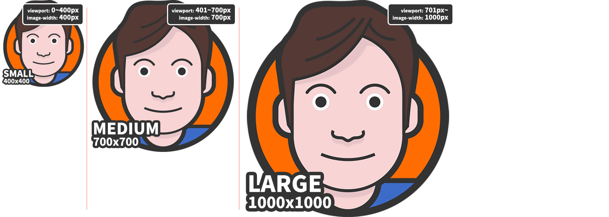
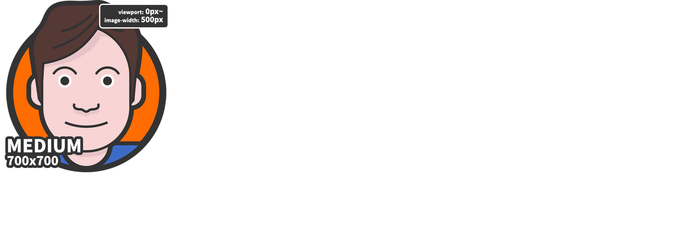

<h1>개요</h1>

***

일반적으로 반응형 웹에서 이미지를 지원하기 위해, ‘미디어쿼리’라고 부르는 CSS Media Rule(<code>@media</code>)에서 <code>background-image</code> 속성을 많이
  사용하는데, 반응형 이미지를 처리하기 위해 뷰포트(Viewport)의 크기부터 사용자 화면의 해상도 등 많은 환경을 고려해야 합니다. 하지만 우리는 HTML IMG의 <code>srcset</code>과
  <code>sizes</code>를 통해 쉽게는 이미지의 크기를 설정하는 것만으로 대부분의 고려 사항을 사용자 브라우저(User agent)에 떠넘길 수 있습니다.

***

<h1>간단한 예제</h1>

***

<pre><code class="html">&lt;img
  srcset=&quot;images/heropy_small.png 400w,
          images/heropy_medium.png 700w,
          images/heropy_large.png 1000w&quot;     
  sizes=&quot;(max-width: 500px) 444px,
         (max-width: 800px) 777px,
         1222px&quot;
  src=&quot;images/heropy.png&quot;
  alt=&quot;HEROPY&quot; /&gt;
</code></pre>

위 예제는 다음과 같이 이해할 수 있습니다. <code>srcset</code> 속성은 쉼표(<code>,</code>)로 구분된 사용할 이미지들의 경로와 해당 이미지의 원본 크기를
  지정하고, <code>sizes</code> 속성은 쉼표(<code>,</code>)로 구분된 미디어조건(선택적)과 그에 따라 최적화되어 출력될 이미지 크기를 지정합니다.

<pre><code class="html">&lt;img
  srcset=&quot;경로 원본크기,
          경로 원본크기,
          경로 원본크기&quot;
  sizes=&quot;(미디어조건) 최적화출력크기,
         (미디어조건) 최적화출력크기,
         기본출력크기&quot;
  src=&quot;경로&quot;
  alt=&quot;대체텍스트&quot; /&gt;
</code></pre>

일반적인 IMG 작성 방식이 아니기 때문에 조금 생소합니다. 하지만 어렵게 생각할 필요가 없습니다! 차근차근 알아봅시다.

<blockquote>
  
<code>src</code> 속성은 <code>srcset</code>을 사용할 수 없는 환경에서 동작합니다!

</blockquote>

***

<h1>srcset</h1>

<code>srcset</code>은 브라우저에 제시할(사용할) 이미지들과 그 이미지들의 원본 크기를 지정합니다.

사용 방법은 간단합니다.

사용할 이미지를 사이즈별로 2장 이상 준비하여 <code>srcset</code> 속성에 작성합니다. 단, 주의사항은 이미지의 크기로 <code>px</code>단위가 아닌 <code>w</code>
  디스크립터 혹은 <code>x</code> 디스크립터를 입력해야 하며, <strong>작은 크기 이미지부터 순서대로 입력</strong>합니다.

***

<h2>W descriptor</h2>

<code>w</code> 디스크립터(Width descriptor)는 이미지의 원본 크기(가로 너비)를 의미합니다. 예를 들어 <code>400x300</code>(px) 크기 이미지의
  <code>w</code> 값은 <code>400w</code>입니다.

<blockquote>
  
브라우저(User agent)는 지정된 <code>w</code> 디스크립터를 통해 각 이미지의 최적화된 픽셀 밀도를 계산합니다.

</blockquote>

다음 예제를 살펴봅시다.

<pre><code class="html">&lt;img
  srcset=&quot;images/heropy_small.png 400w,
          images/heropy_medium.png 700w,
          images/heropy_large.png 1000w&quot;
  src=&quot;images/heropy.png&quot;
  alt=&quot;HEROPY&quot; /&gt;
</code></pre>

위 예제의 결과로, 뷰포트 너비가 400px 이하일 때 <code>heropy_small.png</code>(400px)가 사용됩니다. 뷰포트 너비가 401~700px 일 때
  <code>heropy_medium.png</code>(700px)가 사용됩니다. 뷰포트 너비가 701px 이상일 때 <code>heropy_large.png</code>(1000px)가 사용됩니다.

<blockquote>
  
이하 모든 예제의 뷰포트 너비는 뷰포트의 가로 너비를 의미합니다.

</blockquote>

</img>

우리는 단지 3장의 이미지와 그 크기만 <code>srcset</code>에 입력했을 뿐인데 브라우저는 각 이미지 중 현재 뷰포트 너비에 최적화된 이미지를 선택해 출력합니다. 마치 다음의 CSS
  미디어조건과 비슷합니다.

<pre><code class="css">.some-image {
  width: 400px;
  height: 400px;
  background-image: url(&quot;images/heropy_small.png&quot;);   
  background-repeat: no-repeat;
}
@media (min-width: 401px) {
  .some-image {
    width: 700px;
    height: 700px;
    background-image: url(&quot;images/heropy_medium.png&quot;);   
  }
}
@media (min-width: 701px) {
  .some-image {
    width: 1000px;
    height: 1000px;
    background-image: url(&quot;images/heropy_large.png&quot;);   
  }
}
</code></pre>

고정된 이미지 크기를 유지하려면 <code>width</code> 속성을 추가할 수 있습니다. (<code>sizes</code> 속성과는 다른 개념입니다!)

<pre><code class="html">&lt;img
  srcset=&quot;images/heropy_small.png 400w,
          images/heropy_medium.png 700w,
          images/heropy_large.png 1000w&quot;
  width=&quot;400&quot;
  src=&quot;images/heropy.png&quot;
  alt=&quot;HEROPY&quot; /&gt;
</code></pre>

</img>

이는 다음과 비슷합니다.

<pre><code class="css">.some-image {
  width: 400px;
  height: 400px;
  background-image: url(&quot;images/heropy_small.png&quot;);   
  background-repeat: no-repeat;
  background-size: cover;
}
@media (min-width: 401px) {
  .some-image {
    background-image: url(&quot;images/heropy_medium.png&quot;);   
  }
}
@media (min-width: 701px) {
  .some-image {
    background-image: url(&quot;images/heropy_large.png&quot;);   
  }
}
</code></pre>

***

<h2>X descriptor</a></h2>

<code>x</code> 디스크립터(Device pixel ratio descriptor)는 이미지의 비율 의도를 의미합니다. 위 <code>w</code> 디스크립터에서 사용했던 예제를 다음과 같이
  수정할 수 있습니다.

<pre><code class="html">&lt;img
  srcset=&quot;images/heropy_small.png 1x,
          images/heropy_medium.png 1.75x,
          images/heropy_large.png 2.5x&quot;
  src=&quot;images/heropy.png&quot;
  alt=&quot;HEROPY&quot; /&gt;
</code></pre>

<code>x</code> 디스크립터는 디바이스의 픽셀 비율(Device pixel ratio)과 일치하는 값으로 최적화 선택됩니다. mydevice.io에서 현재 화면의 측정 값을 확인할 수 있습니다.

일반적으로 정수(integer) 값으로 제공하는 것이 좋습니다.

<blockquote>
  
<code>w</code> 디스크립터를 사용하면 <code>x</code> 디스크립터를 사용하지 않아도 됩니다. 많은 경우 <code>w</code> 디스크립터의 사용을 추천합니다.

</blockquote>

***

<h1>sizes</h1>

<code>sizes</code>는 미디어조건과 그 조건에 해당하는 이미지의 ‘최적화 출력 크기’를 지정합니다.

다음 예제를 살펴봅시다.

<pre><code class="html">&lt;img
  srcset=&quot;images/heropy_small.png 400w,
          images/heropy_medium.png 700w,
          images/heropy_large.png 1000w&quot;
  sizes=&quot;(min-width: 1000px) 700px&quot;
  src=&quot;images/heropy.png&quot;
  alt=&quot;HEROPY&quot; /&gt;
</code></pre>

위 예제의 결과로, 뷰포트 너비가 400px 이하일 때 <code>heropy_small.png</code>(400px)가 사용됩니다. 뷰포트 너비가 401~700px 일 때
  <code>heropy_medium.png</code>(700px)가 사용됩니다. 뷰포트 너비가 701~999px 일 때 <code>heropy_large.png</code>(1000px)가
  사용됩니다. 뷰포트 너비가 1000px 이상일 때 <code>heropy_medium.png</code>(700px)가 사용됩니다.

</img>

<code>sizes=&quot;(min-width: 1000px) 700px&quot;</code>에서 <code>(min-width: 1000px)</code>은 ‘뷰포트 너비(가로)가 1000px 이상일
  때’를 의미하며, 이어나오는 <code>700px</code>은 그 조건일 때 이미지를 ‘700px로 최적화 출력하겠다’를 의미합니다. 그렇다면 700px로 이미지를 출력하기 위해
  <code>srcset</code> 목록에서 사용될 최적의 이미지는 <code>heropy_medium.png</code>이며, 결과로 뷰포트 너비(가로)가 1000px 이상일 때
  <code>heropy_medium.png</code>가 사용되었습니다.

다음 예제도 살펴봅시다. 이번엔 미디어조건을 생략했네요.

<pre><code class="html">&lt;img
  srcset=&quot;images/heropy_small.png 400w,
          images/heropy_medium.png 700w,
          images/heropy_large.png 1000w&quot;
  sizes=&quot;500px&quot;
  src=&quot;images/heropy.png&quot;
  alt=&quot;HEROPY&quot; /&gt;
</code></pre>

위 예제의 결과로, 뷰포트 너비와 상관없이(‘헛 상관이 없다고?!’) <code>heropy_medium.png</code>만 사용됩니다. 또한
  <code>heropy_medium.png</code>는 <code>500px</code>의 크기를 가집니다.(원래는 700px 크기의 이미지입니다)

</img>

왜 뷰포트 너비와 상관없이 하나의 이미지만 사용되는지 아직 확실치 않지만, 다음 예제와 비교해 봅시다. 이번엔 <code>sizes</code>는 없고 <code>width</code>가 있네요.

<pre><code class="html">&lt;img
  srcset=&quot;images/heropy_small.png 400w,
          images/heropy_medium.png 700w,
          images/heropy_large.png 1000w&quot;
  width=&quot;500&quot;
  src=&quot;images/heropy.png&quot;
  alt=&quot;HEROPY&quot; /&gt;
</code></pre>

위 예제의 결과로, 뷰포트 너비가 400px 이하일 때 <code>heropy_small.png</code>가 사용됩니다. 뷰포트 너비가 401~700px 일 때
  <code>heropy_medium.png</code>가 사용됩니다. 뷰포트 너비가 701px 이상일 때 <code>heropy_large.png</code>가 사용됩니다. 뷰포트 너비에 따라
  사용되는 이미지가 달라지지만 크기는 <code>500px</code>로 고정되었습니다.

</img>

그럼 이해가 되시나요?! <code>width</code>는 이미지의 ‘출력 크기’만 지정하는 데 반해, <code>sizes</code>는 이미지의 ‘출력 크기’ + ‘최적 크기’도 함께 지정하는
  개념입니다. 따라서 <code>sizes=&quot;500px&quot;</code>이 지정된 첫번째 예제는 <code>500px</code>에 최적화된 이미지로
  <code>heropy_medium.png</code>를 사용했고 이미지 크기도 <code>500px</code>로 설정한 것이죠.

<blockquote>
  
<code>sizes</code>와 <code>width</code>를 같이 작성할 경우 <code>width</code>가 우선합니다.

</blockquote>

개념이 이해되었다면, 다음과 같이 여러 조건을 작성할 수도 있습니다. 쉼표(<code>,</code>)를 사용해 구분한다는 것을 주의하세요.

<pre><code class="html">&lt;img
  srcset=&quot;images/heropy_small.png 400w,
          images/heropy_medium.png 700w,
          images/heropy_large.png 1000w&quot;
  sizes=&quot;(min-width: 701px) 1000px,
         (min-width: 401px) 700px,
         400px&quot;
  src=&quot;images/heropy.png&quot;
  alt=&quot;HEROPY&quot; /&gt;
</code></pre>