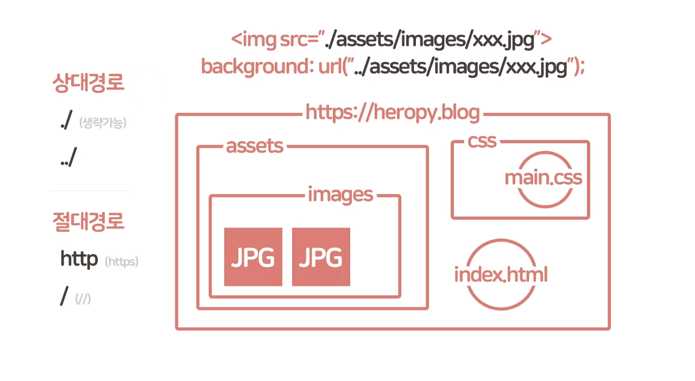
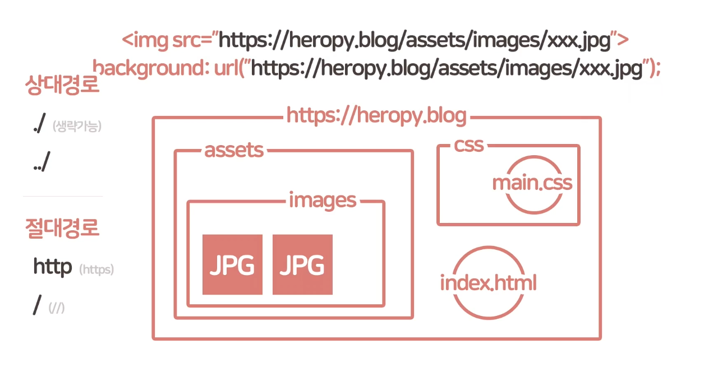
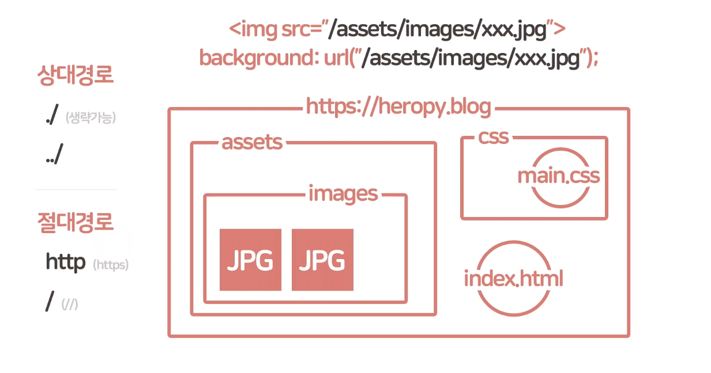

<h1>전역 속성(Global Attributes)</h1>

모든 HTML 요소에서 공통적으로 사용 가능한 속성.

***

<h2>class</h2>

공백으로 구분된 요소의 별칭을 지정. CSS 혹은 JavaScript의 요소 선택기(CSS 선택자나 GetElementsByClassName, QuerySelectorAll 같은)를 통해서 요소를
    선택하거나 접근.

***

<h2>id</h2>

문서에서 고유한 식별자(idenifier, ID)를 정의. 
    CSS 혹은 JavaScript의 요소 선택기(CSS 선택자나 GetElementsByClassName, QuerySelectorAll 같은)를 통해서 요소를 선택하거나 접근.

***

<h2>style</h2>

요소에 적용할 CSS를 선언. 인라인 작성방식 

***

<h2>title</h2>

요소의 정보(설명)을 지정.

***

<h2>lang</h2>

요소의 언어(ISO 639-1)를 지정.

<pre><code class="html">&lt;p lang=&quot;en&quot;&gt;This paragraph is English&lt;/p&gt;
&lt;p lang=&quot;ko&quot;&gt;이 단락은 한글입니다.&lt;/p&gt;
&lt;p lang=&quot;fr&quot;&gt;Ce paragraphe est défini en français.&lt;/p&gt;
</code></pre>

***

<h2>data-*</h2>

사용자 정의 데이터 속성을 지정. HTML에 JavaScript에서 이용할 수 있는 데이터(정보)를 저장하는 용도로 사용.

<pre><code class="html">&lt;!-- data-custom-data-attributes --&gt;
&lt;div id=&quot;me&quot; data-my-name=&quot;Heropy&quot; data-my-age=&quot;851&quot;&gt;Heropy&lt;/div&gt;
</code></pre>
<pre><code class="js">// dataset.customDataAttributes
const $me = document.getElementById(&#39;me&#39;);
console.log($me.dataset.myName); // &quot;Heropy&quot;
console.log($me.dataset.myAge); // &quot;851&quot;
</code></pre>

***

<h2>draggable</h2>

요소가 Drag and Drop API 를 사용 가능한지 여부를 지정.

<pre><code class="html">&lt;div draggable=&quot;true&quot;&gt;The element to drag.&lt;/div&gt;
</code></pre>

***

<h2>hidden</h2>

요소를 숨김.

<pre><code class="html">&lt;form id=&quot;hidden-form&quot; action=&quot;/form-action&quot; hidden&gt;
  &lt;!-- 숨겨진 양식들.. --&gt;
&lt;/form&gt;
&lt;button form=&quot;hidden-form&quot; type=&quot;submit&quot;&gt;전송&lt;/button&gt;
</code></pre>

***

<h2>tabindex</h2>

<code>Tab</code>키를 이용해 요소를 순차적으로 포커스 탐색할 순서를 지정.

<ul>
    <li>대화형 콘텐츠(Interactive Content)는 기본적으로 코드 순서대로 탭 순서가 지정됨.</li>
    <li>비대화형 콘텐츠에 <code>tabindex=&quot;0&quot;</code>을 지정하여 대화형 콘텐츠와 같이 탭 순서를 사용.</li>
    <li><code>tabindex=&quot;-1&quot;</code>을 통해 포커스는 가능하지만 탭 순서에서 제외 가능.</li>
    <li><code>tabindex=&quot;1&quot;</code> 이상의 양수 값은 논리적 흐름을 방해하기 때문에 사용을 추천하지 않음.</li>
</ul>
<pre><code class="html">&lt;h1 tabindex=&quot;0&quot;&gt;Sign In&lt;/h1&gt;
&lt;label&gt;Username: &lt;input type=&quot;text&quot;&gt;&lt;/label&gt;
&lt;label&gt;Password: &lt;input type=&quot;password&quot;&gt;&lt;/label&gt;
&lt;label&gt;PS: &lt;input type=&quot;text&quot; tabindex=&quot;-1&quot;&gt;&lt;/label&gt;
&lt;input type=&quot;submit&quot; value=&quot;Sign In&quot;&gt;
</code></pre>

<a href="https://developer.paciellogroup.com/blog/2014/08/using-the-tabindex-attribute/" target="_blank"
        rel="noopener">Using the tabindex attribute</a>

***

</img>
</img>
</img>

***

<h1>생략한 요소</h1>
<h2>&lt;template&gt;</h2>

렌더링되지 않는 콘텐츠를 보유.

<ul>
    <li>JavaScript를 사용해 렌더링.</li>
    <li>반복적으로 사용하는 콘텐츠에 활용.</li>
    <li>IE 지원 불가</li>
</ul>

***

<h2>&lt;map&gt;, &lt;area&gt;</h2>

클라이언트 측 이미지 맵(<code>&lt;map&gt;</code>)과 클릭 가능한 영역(<code>&lt;area&gt;</code>)을 정의. (<code>&lt;img /&gt;</code>와
    연결해 사용)

***

<h2>&lt;picture&gt;</h2>

이미지를 삽입. (<code>&lt;img /&gt;</code>의 <code>srcset</code>, <code>sizes</code>로 대체 가능)

***

<h2>&lt;source&gt;</h2>

브라우저가 선택 가능한 <code>&lt;audio&gt;</code>, <code>&lt;video&gt;</code>, <code>&lt;picture&gt;</code>등의 다중 미디어 리소스를 지정.

***

<h2>&lt;track&gt;</h2>

<code>&lt;audio&gt;</code>, <code>&lt;video&gt;</code> 같은 미디어가 재생 중일 때 표시될 자막, 캡션 파일 등을 지정.

***

<h2>&lt;embed&gt;</h2>

외부 응용 프로그램이나 대화형 플러그인을 삽입.

***

<h2>&lt;object&gt;</h2>

멀티미디어, 중첩된 브라우저 컨텍스트(프레임), 플러그인 등을 삽입.

<h2>&lt;param&gt;</h2>

<code>&lt;object&gt;</code>의 매개 변수를 정의.

***

<h1>생략한 속성</h1>
<table>
    <thead>
        <tr>
            <th>사용 태그</th>
            <th>속성</th>
            <th>의미</th>
            <th>값</th>
            <th>특징</th>
        </tr>
    </thead>
    <tbody>
        <tr>
            <td><code>&lt;link /&gt;</code>, <code>&lt;a&gt;</code></td>
            <td>hreflang</td>
            <td>현재 페이지의 대체 언어(ISO 639-1)</td>
            <td><code>ko</code>, <code>en</code>…</td>
            <td>다른 언어 또는 지역별 여러 버전의 페이지가 있는 경우
            </td>
        </tr>
        <tr>
            <td><code>&lt;ol&gt;</code></td>
            <td>reversed</td>
            <td>항목을 역순으로 설정</td>
            <td></td>
            <td>IE 지원 불가</td>
        </tr>
        <tr>
            <td><code>&lt;link&gt;</code>, <code>&lt;img
                    /&gt;</code>, <code>&lt;video&gt;</code>, <code>&lt;script&gt;</code></td>
            <td>crossorigin</td>
            <td>가져 오기가 CORS를 사용하여 수행되어야하는지 여부</td>
            <td><code>anonymous</code>, <code>use-credentials</code></td>
            <td></td>
        </tr>
        <tr>
            <td><code>&lt;img /&gt;</code></td>
            <td>ismap</td>
            <td>서버 측 이미지 맵으로 지정해 클릭하여 좌표를 쿼리스트링으로 서버에 전송할지 여부</td>
            <td>불린(Boolean)</td>
            <td><code>&lt;img /&gt;</code>가 유효한 <code>href</code> 속성을 가진 <code>&lt;a&gt;</code>의 하위 요소인 경우에만 허용</td>
        </tr>
        <tr>
            <td><code>&lt;img /&gt;</code></td>
            <td>usemap</td>
            <td>클라이언트 측 이미지 맵으로 지정</td>
            <td><code>&lt;map&gt;</code>의 <code>#</code> + <code>name</code> 속성 값</td>
            <td><code>&lt;a&gt;</code>, <code>&lt;button&gt;</code>의 하위 요소인 경우 사용 불가</td>
        </tr>
        <tr>
            <td><code>&lt;form&gt;</code></td>
            <td>accept-charset</td>
            <td>서버가 받을 문자인코딩 방식</td>
            <td><code>UTF-8</code>, <code>EUC-KR</code>…</td>
            <td><code>UNKNOWN</code></td>
        </tr>
        <tr>
            <td><code>&lt;form&gt;</code></td>
            <td>enctype</td>
            <td><code>method</code>속성이 <code>POST</code>일 경우, 서버로 전송하는 콘텐츠의 MIME 타입</td>
            <td></td>
            <td></td>
        </tr>
        <tr>
            <td><code>&lt;input /&gt;</code></td>
            <td>accept</td>
            <td>서버가 받을 파일 종류</td>
            <td>파일 확장자(<code>.jpg</code>, <code>.png</code>..), MIME
                    타입, <code>audio/*</code>, <code>video/*</code>, <code>image/*</code></td>
            <td><code>type=&quot;file&quot;</code></td>
        </tr>
        <tr>
            <td><code>&lt;input /&gt;</code></td>
            <td>width</td>
            <td>이미지의 가로 너비</td>
            <td>숫자(Number)</td>
            <td><code>type=&quot;image&quot;</code></td>
        </tr>
        <tr>
            <td><code>&lt;input /&gt;</code></td>
            <td>height</td>
            <td>이미지의 가로 너비</td>
            <td>숫자(Number)</td>
            <td><code>type=&quot;image&quot;</code></td>
        </tr>
        <tr>
            <td><code>&lt;input /&gt;</code>, <code>&lt;button&gt;</code></td>
            <td>formaction</td>
            <td>양식을 제출할 때 양식 데이터를 보낼 위치</td>
            <td>URL</td>
            <td><code>type=&quot;submit&quot;</code>, <code>type=&quot;image&quot;</code>, <code>form</code>의 속성보다
                우선</td>
        </tr>
        <tr>
            <td><code>&lt;input /&gt;</code>, <code>&lt;button&gt;</code></td>
            <td>formenctype</td>
            <td>양식 데이터를 서버로 보내기 전에 인코딩 할 방법을 지정</td>
            <td>-</td>
            <td><code>type=&quot;submit&quot;</code>, <code>type=&quot;image&quot;</code>, <code>form</code>의 속성보다
                우선</td>
        </tr>
        <tr>
            <td><code>&lt;input /&gt;</code>, <code>&lt;button&gt;</code></td>
            <td>formmethod</td>
            <td>양식 데이터를 보내는 방법</td>
            <td><code>GET</code>, <code>POST</code></td>
            <td><code>type=&quot;submit&quot;</code>, <code>type=&quot;image&quot;</code>, <code>form</code>의 속성보다
                우선</td>
        </tr>
        <tr>
            <td><code>&lt;input /&gt;</code>, <code>&lt;button&gt;</code></td>
            <td>formnovalidate</td>
            <td>양식 데이터의 유효성을 검사하지 않도록 지정</td>
            <td>불린(Boolean)</td>
            <td><code>type=&quot;submit&quot;</code>, <code>type=&quot;image&quot;</code>, <code>form</code>의 속성보다
                우선</td>
        </tr>
        <tr>
            <td><code>&lt;input /&gt;</code>, <code>&lt;button&gt;</code></td>
            <td>formtarget</td>
            <td></td>
            <td><code>_self</code>, <code>_blank</code></td>
            <td><code>type=&quot;submit&quot;</code>, <code>type=&quot;image&quot;</code>, <code>form</code>의 속성보다
                우선</td>
        </tr>
        <tr>
            <td><code>&lt;input /&gt;,</code> <code>&lt;textarea&gt;</code></td>
            <td>minlength</td>
            <td>입력 가능한 최소 문자 수</td>
            <td>숫자(Number)</td>
            <td><code>type=&quot;text&quot;</code>, <code>type=&quot;email&quot;</code>, <code>type=&quot;password&quot;</code>, <code>type=&quot;tel&quot;</code>, <code>type=&quot;url&quot;</code>
            </td>
        </tr>
        <tr>
            <td><code>&lt;input /&gt;</code></td>
            <td>pattern</td>
            <td>양식의 값을 검사하는 정규표현식</td>
            <td>정규표현식(RegExp)</td>
            <td><code>type=&quot;text&quot;</code>, <code>type=&quot;search&quot;</code>, <code>type=&quot;tel&quot;</code>, <code>type=&quot;url&quot;</code>, <code>type=&quot;email&quot;</code>
            </td>
        </tr>
        <tr>
            <td><code>&lt;input /&gt;</code>, <code>&lt;textarea&gt;</code>, <code>&lt;select&gt;</code></td>
            <td>required</td>
            <td>필수 여부</td>
            <td>불린(Boolean)</td>
            <td></td>
        </tr>
        <tr>
            <td><code>&lt;input /&gt;</code></td>
            <td>size</td>
            <td>양식의 가로 너비</td>
            <td>숫자(Number, <code>20</code>)</td>
            <td>평균 문자 너비를 기준</td>
        </tr>
        <tr>
            <td><code>&lt;input /&gt;</code>, <code>&lt;textarea&gt;</code></td>
            <td>spellcheck</td>
            <td>맞춤법 및 문법 검사의 필요 여부</td>
            <td><code>true</code>, <code>false</code></td>
            <td></td>
        </tr>
        <tr>
            <td><code>&lt;button&gt;</code></td>
            <td>value</td>
            <td>폼 데이터와 함께 전송되는 버튼의 초기값</td>
            <td></td>
            <td>IE 지원 불가</td>
        </tr>
        <tr>
            <td><code>&lt;textarea&gt;</code></td>
            <td>cols</td>
            <td>양식의 가로 너비</td>
            <td>숫자(Number, <code>20</code>)</td>
            <td>평균 문자 너비를 기준</td>
        </tr>
    </tbody>
</table>

***

<h1>생략한 전역 속성</h1>
<h2>accesskey</h2>

요소의 키보드 단축키 힌트를 제공.

<ul>
    <li>다음의 이유 등으로 일반 목적의 웹사이트에서는 사용을 권장하지 않음.<ul>
            <li>브라우저 키보드 단축키 혹은 보조기기의 기능과 충돌</li>
            <li>특정 키보드의 존재하지 않는 키 사용</li>
            <li>숫자 같은 논리적인 관계가 없는 키 지정</li>
            <li><code>accesskey</code>의 존재를 모르는 사용자의 실수</li>
        </ul>
    </li>
</ul>
<pre><code class="html">&lt;a href=&quot;https://google.com&quot; accesskey=&quot;G&quot;&gt;Press &#39;Alt&#39; + &#39;G&#39; key on Chrome!&lt;/a&gt;
</code></pre>

***

<h2>contenteditable</h2>

요소의 사용자 편집 여부를 지정.

<pre><code class="html">&lt;style&gt;
  p::before { content: &quot;[&quot;; }
  p::after { content: &quot;]&quot;; }
&lt;/style&gt;

&lt;blockquote contenteditable=&quot;true&quot;&gt;
  &lt;p&gt;Edit this content to add your own bracket.&lt;/p&gt;
&lt;/blockquote&gt;
</code></pre>
