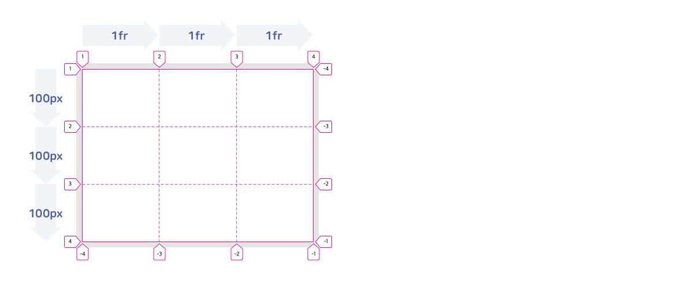
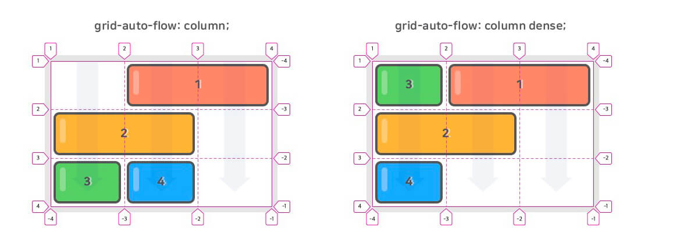
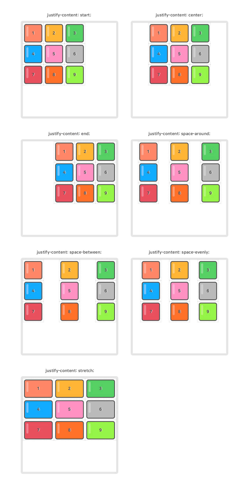
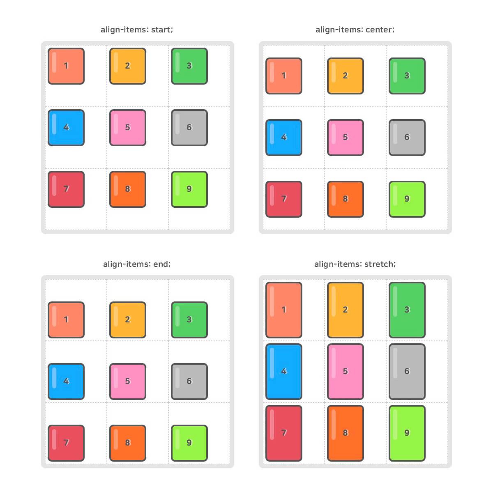
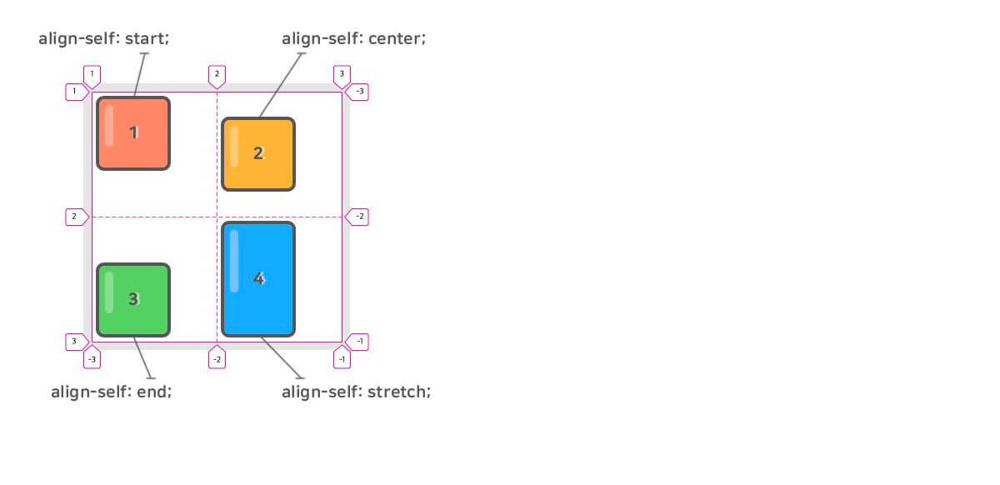
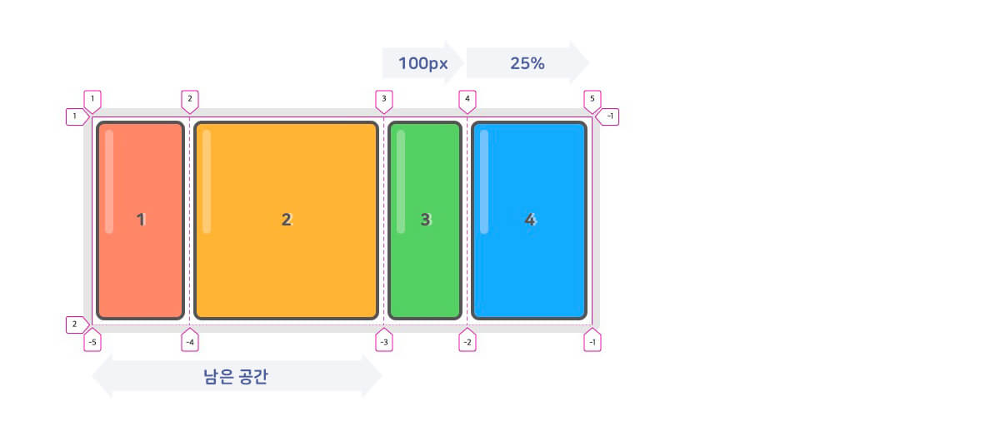

<h1>CSS Grid<h1>
<br>
<p>CSS Grid(그리드)는 2차원(행과 열)의 레이아웃 시스템을 제공합니다.<br>Flexible Box도 훌륭하지만 비교적 단순한 1차원 레이아웃을 위하며, 좀 더 복잡한 레이아웃을 위해 우리는 CSS
    Grid를 사용할 수 있습니다.</p>
<blockquote>
    <p>CSS Grid는 예전부터 핵(Hack)으로 불린 다양한 레이아웃 대체 방식들을 해결하기 위해 만들어진 특별한 CSS 모듈입니다.</p>
</blockquote>

<h2>CSS Grid</h2>

<p>파이어폭스 브라우저</a>를 사용해 테스트할 것을 추천합니다.<br>개발자 도구를 열고 요소를 검색해 표시된 <code>grid</code> 버튼을 선택합니다.</p>
<p>CSS Grid를 처음 시작하시는 분들을 위해 간단한 테스트 영상을 준비했습니다.</p>

[테스트 영상](https://youtu.be/b0aSTppYUFE)

<br>
<p>다음은 위 영상과 이하 예제들에서 사용한 샘플 코드입니다.<br>SCSS로 작성되어 있지만, CSS 문법을 포함할 수
    있음으로 <code>// Test here!</code> 이하에 <code>.container</code>와 <code>.item</code>을 정의해 보세요.<br>혹은 새로운 환경에서 Grid를 테스트해
    보세요.</p>

```html
<div class="container">
    <div class="item">1</div>
    <div class="item">2</div>
    <div class="item">3</div>
    <div class="item">4</div>
    <div class="item">5</div>
    <div class="item">6</div>
</div>
```
```SCSS
// Init~ Don't touch here!
$color: #555;

body {
    padding: 80px;
    font-family: 'NanumSquareRound', sans-serif;
    color: $color;
}

.container {
    // width: 380px;
    // height: 250px;
    border: 10px solid rgba(black, .1);
    border-radius: 10px;
    display: grid;
}

.item {
    display: flex;
    justify-content: center;
    align-items: center;
    padding: 20px;
    box-sizing: border-box;
    position: relative;
    font-size: 20px;
    color: $color;
    font-weight: 900;
    text-shadow: 3px 0 0 rgba(white, .5);

    &::before {
        content: "";
        position: absolute;
        top: 5px;
        left: 5px;
        border: 4px solid $color;
        border-radius: 10px;
        box-sizing: border-box;
        width: calc(100% - 10px);
        height: calc(100% - 10px);
        z-index: -1;
    }

    $colors: (tomato, orange, limegreen, dodgerblue, hotpink, darkgray, crimson, orangered, lawngreen, aqua, royalblue, wheat, brown, gray, salmon, deeppink, gold, springgreen, slateblue, darkslategray);

    @each $color in $colors {
        $index: index($colors, $color);

        &:nth-child(#{$index})::before {
            background-color: rgba($color, .8);
        }
    }

    &::after {
        content: "";
        width: 10px;
        height: 50%;
        background: white;
        position: absolute;
        top: 16px;
        left: 16px;
        border-radius: 100px;
        opacity: .3;
        z-index: -1;
    }
}


// Test here!
.container {
    width: 400px;
    display: grid;
    grid-template-rows: repeat(2, 100px);
    grid-template-columns: repeat(3, 1fr);
    grid-auto-rows: 100px;
}

.item:nth-child(1) {
    grid-column: 1 / 4;
}

.item:nth-child(3) {
    grid-column: span 2;
}

View Compiled Resources
```
```CSS
body {
    padding: 80px;
    font-family: "NanumSquareRound", sans-serif;
    color: #555;
}

.container {
    border: 10px solid rgba(0, 0, 0, 0.1);
    border-radius: 10px;
    display: grid;
}

.item {
    display: flex;
    justify-content: center;
    align-items: center;
    padding: 20px;
    box-sizing: border-box;
    position: relative;
    font-size: 20px;
    color: #555;
    font-weight: 900;
    text-shadow: 3px 0 0 rgba(255, 255, 255, 0.5);
}

.item::before {
    content: "";
    position: absolute;
    top: 5px;
    left: 5px;
    border: 4px solid #555;
    border-radius: 10px;
    box-sizing: border-box;
    width: calc(100% - 10px);
    height: calc(100% - 10px);
    z-index: -1;
}

.item:nth-child(1)::before {
    background-color: rgba(255, 99, 71, 0.8);
}

.item:nth-child(2)::before {
    background-color: rgba(255, 165, 0, 0.8);
}

.item:nth-child(3)::before {
    background-color: rgba(50, 205, 50, 0.8);
}

.item:nth-child(4)::before {
    background-color: rgba(30, 144, 255, 0.8);
}

.item:nth-child(5)::before {
    background-color: rgba(255, 105, 180, 0.8);
}

.item:nth-child(6)::before {
    background-color: rgba(169, 169, 169, 0.8);
}

.item:nth-child(7)::before {
    background-color: rgba(220, 20, 60, 0.8);
}

.item:nth-child(8)::before {
    background-color: rgba(255, 69, 0, 0.8);
}

.item:nth-child(9)::before {
    background-color: rgba(124, 252, 0, 0.8);
}

.item:nth-child(10)::before {
    background-color: rgba(0, 255, 255, 0.8);
}

.item:nth-child(11)::before {
    background-color: rgba(65, 105, 225, 0.8);
}

.item:nth-child(12)::before {
    background-color: rgba(245, 222, 179, 0.8);
}

.item:nth-child(13)::before {
    background-color: rgba(165, 42, 42, 0.8);
}

.item:nth-child(14)::before {
    background-color: rgba(128, 128, 128, 0.8);
}

.item:nth-child(15)::before {
    background-color: rgba(250, 128, 114, 0.8);
}

.item:nth-child(16)::before {
    background-color: rgba(255, 20, 147, 0.8);
}

.item:nth-child(17)::before {
    background-color: rgba(255, 215, 0, 0.8);
}

.item:nth-child(18)::before {
    background-color: rgba(0, 255, 127, 0.8);
}

.item:nth-child(19)::before {
    background-color: rgba(106, 90, 205, 0.8);
}

.item:nth-child(20)::before {
    background-color: rgba(47, 79, 79, 0.8);
}

.item::after {
    content: "";
    width: 10px;
    height: 50%;
    background: white;
    position: absolute;
    top: 16px;
    left: 16px;
    border-radius: 100px;
    opacity: 0.3;
    z-index: -1;
}

.container {
    width: 400px;
    display: grid;
    grid-template-rows: repeat(2, 100px);
    grid-template-columns: repeat(3, 1fr);
    grid-auto-rows: 100px;
}

.item:nth-child(1) {
    grid-column: 1/4;
}

.item:nth-child(3) {
    grid-column: span 2;
}
```
<br>
<h1>Grid Properties</h1>

<p>CSS Grid는 CSS Flex와 같이 Container(컨테이너)와 Item(아이템)이라는 두가지 개념으로 구분되어 있습니다.<br>
Container는 Items를 감싸는 부모 요소이며, 그 안에서 각 Item을 배치할 수 있습니다.</p>

<h2>Grid Container Properties</h2>
<p>Grid Container를 위한 속성들은 다음과 같습니다.</p>
<table>
    <thead>
        <tr>
            <th>속성</th>
            <th>의미</th>
        </tr>
    </thead>
    <tbody>
        <tr>
            <td>display</td>
            <td>그리드 컨테이너(Container)를 정의</td>
        </tr>
        <tr>
            <td>grid-template-rows</td>
            <td>명시적 행(Track)의 크기를 정의</td>
        </tr>
        <tr>
            <td>grid-template-columns</td>
            <td>명시적 열(Track)의 크기를 정의</td>
        </tr>
        <tr>
            <td>grid-template-areas</td>
            <td>영역(Area) 이름을 참조해 템플릿 생성</td>
        </tr>
        <tr>
            <td>grid-template</td>
            <td><code>grid-template-xxx</code>의 단축 속성</td>
        </tr>
        <tr>
            <td>row-gap(grid-row-gap)</td>
            <td>행과 행 사이의 간격(Line)을 정의</td>
        </tr>
        <tr>
            <td>column-gap(grid-column-gap)</td>
            <td>열과 열 사이의 간격(Line)을 정의</td>
        </tr>
        <tr>
            <td>gap(grid-gap)</td>
            <td><code>xxx-gap</code>의 단축 속성</td>
        </tr>
        <tr>
            <td>grid-auto-rows</td>
            <td>암시적인 행(Track)의 크기를 정의</td>
        </tr>
        <tr>
            <td>grid-auto-columns</td>
            <td>암시적인 열(Track)의 크기를 정의</td>
        </tr>
        <tr>
            <td>grid-auto-flow</td>
            <td>자동 배치 알고리즘 방식을 정의</td>
        </tr>
        <tr>
            <td>grid</td>
            <td><code>grid-template-xxx</code>과 <code>grid-auto-xxx</code>의 단축 속성</td>
        </tr>
        <tr>
            <td>align-content</td>
            <td>그리드 콘텐츠(Grid Contents)를 수직(열 축) 정렬</td>
        </tr>
        <tr>
            <td>justify-content</td>
            <td>그리드 콘텐츠를 수평(행 축) 정렬</td>
        </tr>
        <tr>
            <td>place-content</td>
            <td><code>align-content</code>와 <code>justify-content</code>의 단축 속성</td>
        </tr>
        <tr>
            <td>align-items</td>
            <td>그리드 아이템(Items)들을 수직(열 축) 정렬</td>
        </tr>
        <tr>
            <td>justify-items</td>
            <td>그리드 아이템들을 수평(행 축) 정렬</td>
        </tr>
        <tr>
            <td>place-items</td>
            <td><code>align-items</code>와 <code>justify-items</code>의 단축 속성</td>
        </tr>
    </tbody>
</table>
<br>
<h2>Grid Item Properties</h2>
<p>Grid Item을 위한 속성들은 다음과 같습니다.</p>
<table>
    <thead>
        <tr>
            <th>속성</th>
            <th>의미</th>
        </tr>
    </thead>
    <tbody>
        <tr>
            <td>grid-row-start</td>
            <td>그리드 아이템(Item)의 행 시작 위치 지정</td>
        </tr>
        <tr>
            <td>grid-row-end</td>
            <td>그리드 아이템의 행 끝 위치 지정</td>
        </tr>
        <tr>
            <td>grid-row</td>
            <td><code>grid-row-xxx</code>의 단축 속성(행 시작/끝 위치)</td>
        </tr>
        <tr>
            <td>grid-column-start</td>
            <td>그리드 아이템의 열 시작 위치 지정</td>
        </tr>
        <tr>
            <td>grid-column-end</td>
            <td>그리드 아이템의 열 끝 위치 지정</td>
        </tr>
        <tr>
            <td>grid-column</td>
            <td><code>grid-column-xxx</code>의 단축 속성(열 시작/끝 위치)</td>
        </tr>
        <tr>
            <td>grid-area</td>
            <td>영역(Area) 이름을 설정하거나, <code>grid-row</code>와 <code>grid-column</code>의 단축 속성</td>
        </tr>
        <tr>
            <td>align-self</td>
            <td>단일 그리드 아이템을 수직(열 축) 정렬</td>
        </tr>
        <tr>
            <td>justify-self</td>
            <td>단일 그리드 아이템을 수평(행 축) 정렬</td>
        </tr>
        <tr>
            <td>place-self</td>
            <td><code>align-self</code>와 <code>justify-self</code>의 단축 속성</td>
        </tr>
        <tr>
            <td>order</td>
            <td>그리드 아이템의 배치 순서를 지정</td>
        </tr>
        <tr>
            <td>z-index</td>
            <td>그리드 아이템의 쌓이는 순서를 지정</td>
        </tr>
    </tbody>
</table>
<br>
<h1>Grid Containers</h1>
<br>
<h2>display</h2>

<p>Grid Container(컨테이너)를 정의합니다.<br>정의된 컨테이너의 자식 요소들은 자동으로 Grid Items(아이템)로 정의됩니다.</p>
<blockquote>
    <p>그리드를 사용하기 위해 컨테이너에 필수로 작성합니다!</p>
</blockquote>
<table>
    <thead>
        <tr>
            <th>값</th>
            <th>의미</th>
        </tr>
    </thead>
    <tbody>
        <tr>
            <td><code>grid</code></td>
            <td>Block 특성의 Grid Container를 정의</td>
        </tr>
        <tr>
            <td><code>inline-grid</code></td>
            <td>Inline 특성의 Grid Container를 정의</td>
        </tr>
    </tbody>
</table>

```css
.container {
    display: grid;
}
```
```html
<div class="container">
    <div class="item">1</div>
    <div class="item">2</div>
    <div class="item">3</div>
</div>
<div class="container">
    <div class="item">1</div>
    <div class="item">2</div>
    <div class="item">3</div>
</div>
```
```css
.container {
    display: grid;
    width: 400px;
    height: 250px;
    border: 4px solid lightcyan;
}

.item {
    border: 2px dashed red;
}
```
<h2>grid-template-rows</h2>

<p>명시적 행(Track)의 크기를 정의합니다.<br>동시에 라인(Line)의 이름도 정의할 수 있습니다.<br><code>fr</code>(fraction, 공간 비율) 단위를 사용할 수
    있습니다.<br><code>repeat()</code> 함수를 사용할 수 있습니다.</p>
<blockquote>
    <p>사용 방법은 <code>grid-template-columns</code>와 같습니다.</p>
</blockquote>

```css
.container {
    display: grid;
    grid-template-rows: 1행크기 2행크기 ...;
    grid-template-rows: [선이름] 1행크기 [선이름] 2행크기 [선이름] ...;
}
```
```css
/* 각 행의 크기를 정의합니다. */
.container {
    grid-template-rows: 100px 200px;
}

/* 동시에 각 라인의 이름도 정의할 수 있습니다. */
.container {
    grid-template-rows: [first] 100px [second] 200px [third];
}

/* 라인에 중복된 이름을 지정할 수 있습니다. */
.container {
    grid-template-rows: [row1-start] 100px [row1-end row2-start] 200px [row2-end];
}
```

<p>각 라인은 행(Row, Track)과 열(Column, Track)의 개수대로 숫자(양수/음수) 라인 이름이 자동으로 지정되어 있어서, 꼭 필요한 경우가 아니면 라인 이름을 정의할 필요가 없습니다.</p>

```css
.container {
    grid-template-rows: 100px 200px;
    /* grid-template-rows: [1 -3] 100px [2 -2] 200px [3 -1]; */
}

``` ```css .container {
    width: 400px;
    display: grid;
    grid-template-rows: repeat(3, 100px);
    grid-template-columns: repeat(3, 1fr);
}
```
<p></p>

<h2>grid-template-columns</h2>

<p>명시적 열(Track)의 크기를 정의합니다.<br>동시에 라인(Line)의 이름도 정의할 수 있습니다.<br><code>fr</code>(fraction, 공간 비율) 단위를 사용할 수
    있습니다.<br><code>repeat()</code> 함수를 사용할 수 있습니다.</p>
<blockquote>
    <p>사용 방법은 <code>grid-template-rows</code>와 같습니다.</p>
</blockquote>

```css
.container {
    display: grid;
    grid-template-columns: 1열크기 2열크기 ...;
    grid-template-columns: [선이름] 1열크기 [선이름] 2열크기 [선이름] ...;
}
```
```css
/* 각 열의 크기를 정의합니다. */
.container {
    grid-template-columns: 100px 200px;
}

/* 동시에 각 라인의 이름도 정의할 수 있습니다. */
.container {
    grid-template-columns: [first] 100px [second] 200px [third];
}

/* 라인에 중복된 이름을 지정할 수 있습니다. */
.container {
    grid-template-columns: [col1-start] 100px [col1-end col2-start] 200px [col2-end];
}
```
<p>만약 <code>1200px</code> 너비의 ‘12컬럼 그리드 템플릿’을 정의한다면 다음과 작성할 수 있습니다.</p>

```css
.container {
    width: 1200px;
    grid-template-columns: 100px 100px 100px 100px 100px 100px 100px 100px 100px 100px 100px 100px;
}
```
<p>12개의 열(컬럼) 크기를 하나씩 지정했습니다만, 이 방법은 당연히 입력도 관리도 힘들겠죠!<br><code>repeat()</code> 함수를 사용하면 위 내용을 다음과 같이 간소화할 수 있습니다.</p>

```css
.container {
    width: 1200px;
    grid-template-columns: repeat(12, 100px);
}
```
<p>컬럼을 크기를 <code>fr</code> 단위를 사용해 다음과 같이 비율로 지정할 수도 있습니다.<br>각 컬럼은 비율에 맞게 출력되기 때문에 컨테이너의 너비가 가변해도 열 크기를 수정할 필요가 없습니다.
</p>
<blockquote>
    <p><code>fr</code> 단위에 대한 좀 더 자세한 내용은 본 포스트 하단에 있는 ‘Grid Units / fr’ 파트에서 확인할 수 있습니다.</p>
</blockquote>

```css
.container {
    width: 80%;
    grid-template-columns: repeat(12, 1fr);
}
```
<p><code>repeat()</code> 함수는 2번째 인수를 반복하기 때문에 다음과 같이 활용할 수 있습니다.</p>

```css
.container {
    grid-template-columns: repeat(4, 100px 200px 50px);
    /* grid-template-columns: 100px 200px 50px 100px 200px 50px 100px 200px 50px 100px 200px 50px; */
  }
.container {
    grid-template-columns: repeat(4, 1fr 2fr 3fr);
    /* grid-template-columns: 1fr 2fr 3fr 1fr 2fr 3fr 1fr 2fr 3fr 1fr 2fr 3fr; */
}
```
<br>
<h2>grid-template-areas</h2>
<p>지정된 그리드 영역 이름(<code>grid-area</code>)을 참조해 그리드 템플릿을 생성합니다.</p>
<blockquote>
    <p><code>grid-area</code>는 Grid Container가 아닌 Grid Item에 적용하는 속성입니다.</p>
</blockquote>

```css
.container {
  display: grid;
  grid-template-rows: repeat(3, 100px);
  grid-template-columns: repeat(3, 1fr);
  grid-template-areas:
    "header header header"
    "main main aside"
    "footer footer footer";
}
header { grid-area: header; }
main   { grid-area: main;   }
aside  { grid-area: aside;  }
footer { grid-area: footer; }
```
<p></p>
<p><code>.</code>(마침표)를 사용하거나 명시적으로 <code>none</code>을 입력해 빈 영역을 정의할 수 있습니다.</p>

```css
.container {
  display: grid;
  grid-template-rows: repeat(4, 100px);
  grid-template-columns: repeat(3, 1fr);
  grid-template-areas:
    "header header header"
    "main . ."
    "main . aside"
    "footer footer footer";
}
header { grid-area: header; }
main   { grid-area: main;   }
aside  { grid-area: aside;  }
footer { grid-area: footer; }
```
<p></p>
<br>
<h2>grid-template</h2>
<p><code>grid-template-rows</code>, <code>grid-template-columns</code> 그리고 <code>grid-template-areas</code>의 단축 속성입니다.
</p>

```css
.container {
  grid-template: <grid-template-rows> / <grid-template-columns>;
  grid-template: <grid-template-areas>;
}
```
<p>다음과 같이 작성할 수도 있습니다.</p>

```css
.container {
  grid-template:
    [1행시작선이름] "AREAS" 행너비 [1행끝선이름]
    [2행시작선이름] "AREAS" 행너비 [2행끝선이름]
    / <grid-template-columns>;
}
```
```css
.container {
  display: grid;
  grid-template:
    "header header header" 80px
    "main main aside" 350px
    "footer footer footer" 130px
    / 2fr 100px 1fr;
}
header { grid-area: header; }
main   { grid-area: main; }
aside  { grid-area: aside; }
footer { grid-area: footer; }
```
<p>위 예제의 컨테이너는 다음과 같이 해석할 수 있습니다.</p>

```css
.container {
  display: grid;
  grid-template-rows: 80px 350px 130px;
  grid-template-columns: 2fr 100px 1fr;
  grid-template-areas:
    "header header header"
    "main main aside"
    "footer footer footer";
}
```
<br>
<h2>row-gap(grid-row-gap)</h2>
<p>각 행과 행 사이의 간격(Gutter)을 지정합니다.</p>
<blockquote>
    <p>더 명확하게는 그리드 선(Grid Line)의 크기를 지정한다고 표현할 수 있습니다.</p>
</blockquote>

```css
.container {
  row-gap: 크기;
}
```
<br>
<h2>column-gap(grid-column-gap)</h2>
<p>각 열과 열 사이의 간격(Gutter)을 지정합니다.</p>

```css
.container {
  column-gap: 크기;
}
```
<br>
<h2>gap(grid-gap)</h2>
<p>각 행과 행, 열과 열 사이의 간격(Gutter)을 지정합니다.</p>

```css
.container {
  gap: <grid-row-gap> <grid-column-gap>;
}
```
```css
.container {
  display: grid;
  grid-template-rows: repeat(2, 150px);
  grid-template-columns: repeat(3, 1fr);
  gap: 20px 10px;
}
/* 하나의 값으로 통일할 수 있습니다. */
.container {
  gap: 10px;  /* row-gap: 10px; + column-gap: 10px; */
}
/* 하나의 값만 적용하고자 한다면 다음과 같이 사용할 수 있습니다. */
.container {
  gap: 10px 0; /* row-gap */
  gap: 0 10px; /* column-gap */
}
```
<p></p>
<p><code>grid-gap</code>(<code>grid-row-gap</code>, <code>grid-column-gap</code>)의 접두사 <code>grid-</code>는 더 이상 사용되지
    않으며(Deprecated), <code>gap</code>(<code>row-gap</code>, <code>column-gap</code>)로 교체되었습니다.<br>하지만 일부 버전의 브라우저 지원을 위해
    <code>grid-</code> 접두사의 사용을 고려할 수 있습니다.</p>
<br>

[[css-grid][css-multicol][css-flexbox][css-tables] Proposal for Various Gap Issues.](https://drafts.csswg.org/css-grid/#change-2016-grid-gap])<br>
[[css-grid] grid-gap is deprecated.](https://github.com/postcss/autoprefixer/issues/1046)<br>
[https://drafts.csswg.org/css-grid/#change-2016-grid-gap](https://drafts.csswg.org/css-grid/#change-2016-grid-gap)

<br>
<br>
<h2>grid-auto-rows</h2>

<p>암시적 행(Track)의 크기를 정의합니다.<br>아이템(Item)이 <code>grid-template-rows</code>로 정의한 명시적 행 외부에 배치되는 경우 암시적 행의 크기가 적용됩니다.</p>

```html
<div class="container">
  <div class="item">1</div>
  <div class="item">2</div>
  <div class="item">3</div>
</div>
```
```css
.container {
  width: 300px;
  height: 200px;
  display: grid;
  grid-template-rows: 100px 100px; /* 명시적 2개 행 정의 */
  grid-template-columns: 150px 150px; /* 명시적 2개 열 정의 */
  grid-auto-rows: 100px; /* 그 외(암시적) 행의 크기 정의 */
}
.item:nth-child(3) {
  grid-row: 3 / 4;
}
```
<p></p>
<br>
<h2>grid-auto-columns</h2>
<p>암시적 열(Track)의 크기를 정의합니다.<br>아이템(Item)이 <code>grid-template-columns</code>로 정의한 명시적 열 외부에 배치되는 경우 암시적 열의 크기가 적용됩니다.
</p>

```css
.container {
  width: 300px;
  height: 200px;
  display: grid;
  grid-template-rows: 100px 100px;
  grid-template-columns: 150px 150px;
  grid-auto-rows: 100px;
  grid-auto-columns: 100px;
}
.item:nth-child(3) {
  grid-row: 3 / 4;
  grid-column: 3 / 4;
}
```
<p></p>

<p>다음과 같이 아이템이 배치되는 위치에 맞게 암시적 행과 열의 개수가 생성됩니다.<br>
암시적 크기가 적용된 행과 열은 양수 라인 번호만 사용할 수 있습니다.(음수 사용 불가)</p>

<p></p>
<br>
<h2>grid-auto-flow</h2>
<p>배치하지 않은 아이템(Item)을 어떤 방식의 ‘자동 배치 알고리즘’으로 처리할지 정의합니다.</p>
<blockquote>
    <p>배치한 아이템은 <code>grid-area</code>(이하 개별 속성 포함)를 사용한 아이템을 의미합니다.</p>
</blockquote>
<table>
    <thead>
        <tr>
            <th>값</th>
            <th>의미</th>
            <th>기본값</th>
        </tr>
    </thead>
    <tbody>
        <tr>
            <td>row</td>
            <td>각 행 축을 따라 차례로 배치</td>
            <td><code>row</code></td>
        </tr>
        <tr>
            <td>column</td>
            <td>각 열 축을 따라 차례로 배치</td>
            <td></td>
        </tr>
        <tr>
            <td>row dense(dense)</td>
            <td>각 행 축을 따라 차례로 배치, 빈 영역 메움!</td>
            <td></td>
        </tr>
        <tr>
            <td>column dense</td>
            <td>각 열 축을 따라 차례로 배치, 빈 영역 메움!</td>
            <td></td>
        </tr>
    </tbody>
</table>
<p>다음은 <code>row</code>와 <code>row dense</code>에 대한 예제입니다.</p>

```css
/* For row & row dense */
.container {
  display: grid;
  grid-template-rows: repeat(3, 1fr);
  grid-template-columns: repeat(3, 1fr);
  grid-auto-flow: row || row dense || dense;
}
.item:nth-child(2) {
  grid-column: span 3;
}
```
<p></p>
<p>다음은 <code>column</code>과 <code>column dense</code>에 대한 예제입니다.</p>

```css
/* For column & column dense */
.container {
  display: grid;
  grid-template-rows: repeat(3, 1fr);
  grid-template-columns: repeat(3, 1fr);
  grid-auto-flow: column || column dense;
}
.item:nth-child(1) {
  grid-column: 2 / span 2;
}
.item:nth-child(2) {
  grid-column: span 2;
}
```
<p></p>

<br>
<h2>grid</h2>
<p><code>grid-template-xxx</code>과 <code>grid-auto-xxx</code>의 단축 속성입니다.</p>

```css
.container {
  grid: <grid-template>;
  grid: <grid-template-rows> / <grid-auto-flow> <grid-auto-columns>;
  grid: <grid-auto-flow> <grid-auto-rows> / <grid-template-columns>;
}
```
<p>각 코드 블록 내 컨테이너(<code>.container</code>)들은 모두 같은 의미입니다.</p>

```css
.container {
  grid: <grid-template-rows> / <grid-template-columns>;
}
.container {
  grid: 100px 200px / 1fr 2fr;
}
.container {
  grid-template-rows: 100px 200px;
  grid-template-columns: 1fr 2fr;
}
```
```css
.container {
  grid: <grid-template>;
}
.container {
  grid:
    "header header header" 80px
    "main main aside" 350px
    "footer footer footer" 130px
    / 2fr 100px 1fr;
}
.container {
  grid-template:
    "header header header" 80px
    "main main aside" 350px
    "footer footer footer" 130px
    / 2fr 100px 1fr;
}
```

<p><code>grid-auto-flow</code>를 작성할 때는 <code>auto-flow</code> 키워드를 사용합니다.<br><code>/</code>로 구분해 작성하는 위치가 곧
    <code>row</code>, <code>column</code> 값을 의미합니다.<br>따라서, <code>row</code>, <code>column</code> 값은 작성하지
    마세요.<br><code>dense</code> 값은 <code>auto-flow</code> 뒤에 붙여줍니다.</p>

```css
.container {
  grid: <grid-template-rows> / <grid-auto-flow> <grid-auto-columns>;
}
.container {
  grid: 100px 100px / auto-flow 150px;
}
.container {
  grid-template-row: 100px 100px;
  grid-auto-flow: column;
  grid-auto-columns: 150px;
}
```
```css
.container {
  grid: <grid-auto-flow> <grid-auto-rows> / <grid-template-columns>;
}
.container {
  grid: auto-flow 150px / 100px 100px;
}
.container {
  grid-template-columns: 100px 100px;
  grid-auto-flow: row;
  grid-auto-rows: 150px;
}
```
```css
.container {
  grid: auto-flow dense 150px / 100px 100px;
}
.container {
  grid-template-columns: 100px 100px;
  grid-auto-flow: row dense;
  grid-auto-rows: 150px;
}
```
<br>
<h2>align-content</h2>
<p>그리드 콘텐츠(Contents)를 수직(열 축) 정렬합니다.<br>그리드 콘텐츠의 세로 너비가 그리드 컨테이너(Container)보다 작아야 합니다.</p>
<table>
    <thead>
        <tr>
            <th>값</th>
            <th>의미</th>
            <th>기본값</th>
        </tr>
    </thead>
    <tbody>
        <tr>
            <td>normal</td>
            <td><code>stretch</code>와 같습니다.</td>
            <td><code>normal</code></td>
        </tr>
        <tr>
            <td>start</td>
            <td>시작점(위쪽) 정렬</td>
            <td></td>
        </tr>
        <tr>
            <td>center</td>
            <td>수직 가운데 정렬</td>
            <td></td>
        </tr>
        <tr>
            <td>end</td>
            <td>끝점(아래쪽) 정렬</td>
            <td></td>
        </tr>
        <tr>
            <td>space-around</td>
            <td>각 행 위아래에 여백을 고르게 정렬</td>
            <td></td>
        </tr>
        <tr>
            <td>space-between</td>
            <td>첫 행은 시작점에, 끝 행은 끝점에 정렬되고 나머지 여백으로 고르게 정렬</td>
            <td></td>
        </tr>
        <tr>
            <td>space-evenly</td>
            <td>모든 여백을 고르게 정렬</td>
            <td></td>
        </tr>
        <tr>
            <td>stretch</td>
            <td>열 축을 채우기 위해 그리드 콘텐츠를 늘림</td>
            <td></td>
        </tr>
    </tbody>
</table>

```css
.container {
  width: 450px;
  height: 450px;
  display: grid;
  grid-template-rows: repeat(3, 100px);
  grid-template-columns: repeat(3, 100px);
  align-content: <align-content>;
}
```
<p></p>

<br>
<h2>justify-content</h2>
<p>그리드 콘텐츠(Contents)를 수평(행 축) 정렬합니다.<br>그리드 콘텐츠의 가로 너비가 그리드 컨테이너(Container)보다 작아야 합니다.</p>
<table>
    <thead>
        <tr>
            <th>값</th>
            <th>의미</th>
            <th>기본값</th>
        </tr>
    </thead>
    <tbody>
        <tr>
            <td>normal</td>
            <td><code>stretch</code>와 같습니다.</td>
            <td><code>normal</code></td>
        </tr>
        <tr>
            <td>start</td>
            <td>시작점(왼쪽) 정렬</td>
            <td></td>
        </tr>
        <tr>
            <td>center</td>
            <td>수평 가운데 정렬</td>
            <td></td>
        </tr>
        <tr>
            <td>end</td>
            <td>끝점(오른쪽) 정렬</td>
            <td></td>
        </tr>
        <tr>
            <td>space-around</td>
            <td>각 열 좌우에 여백을 고르게 정렬</td>
            <td></td>
        </tr>
        <tr>
            <td>space-between</td>
            <td>첫 열은 시작점에, 끝 열은 끝점에 정렬되고 나머지 여백으로 고르게 정렬</td>
            <td></td>
        </tr>
        <tr>
            <td>space-evenly</td>
            <td>모든 여백을 고르게 정렬</td>
            <td></td>
        </tr>
        <tr>
            <td>stretch</td>
            <td>행 축을 채우기 위해 그리드 콘텐츠를 늘림</td>
            <td></td>
        </tr>
    </tbody>
</table>

```css
.container {
  width: 450px;
  height: 450px;
  display: grid;
  grid-template-rows: repeat(3, 100px);
  grid-template-columns: repeat(3, 100px);
  justify-content: <justify-content>;
}
```
<p></p>
<br>
<h2>place-content></h2>
<p><code>align-content</code>와 <code>justify-content</code>의 단축 속성입니다.<br>하나의 값만 입력하면 두 속성에 모두 적용됩니다.</p>
<blockquote>
    <p>Edge(IE) 브라우저에서 지원하지 않는 속성입니다.</p>
</blockquote>

```css
.container {
  place-content: <align-content> <justify-content>;
}
```
<p>각 코드 블록 내 컨테이너(<code>.container</code>)들은 모두 같은 의미입니다.</p>

```css
.container {
  place-content: center space-evenly;
}
.container {
  align-content: center;
  justify-content: space-evenly;
}
```
```css
.container {
  place-content: end;
}
.container {
  align-content: end;
  justify-content: end;
}
```
<br>
<h2>align-items</h2>
<p>그리드 아이템(Items)들을 수직(열 축) 정렬합니다.<br>그리드 아이템의 세로 너비가 자신이 속한 그리드 행(Track)의 크기보다 작아야 합니다.</p>
<table>
    <thead>
        <tr>
            <th>값</th>
            <th>의미</th>
            <th>기본값</th>
        </tr>
    </thead>
    <tbody>
        <tr>
            <td>normal</td>
            <td><code>stretch</code>와 같습니다.</td>
            <td><code>normal</code></td>
        </tr>
        <tr>
            <td>start</td>
            <td>시작점(위쪽) 정렬</td>
            <td></td>
        </tr>
        <tr>
            <td>center</td>
            <td>수직 가운데 정렬</td>
            <td></td>
        </tr>
        <tr>
            <td>end</td>
            <td>끝점(아래쪽) 정렬</td>
            <td></td>
        </tr>
        <tr>
            <td>stretch</td>
            <td>열 축을 채우기 위해 그리드 아이템을 늘림</td>
            <td></td>
        </tr>
    </tbody>
</table>

```css
.container {
  width: 450px;
  height: 450px;
  display: grid;
  grid-template-rows: repeat(3, 1fr);
  grid-template-columns: repeat(3, 1fr);
  align-items: <align-items>;
}
```
<p></p>
<br>
<h2>justify-items</h2>
<p>그리드 아이템(Items)들을 수평(행 축) 정렬합니다.<br>그리드 아이템의 가로 너비가 자신이 속한 그리드 열(Track)의 크기보다 작아야 합니다.</p>
<table>
    <thead>
        <tr>
            <th>값</th>
            <th>의미</th>
            <th>기본값</th>
        </tr>
    </thead>
    <tbody>
        <tr>
            <td>normal</td>
            <td><code>stretch</code>와 같습니다.</td>
            <td><code>normal</code></td>
        </tr>
        <tr>
            <td>start</td>
            <td>시작점(왼쪽) 정렬</td>
            <td></td>
        </tr>
        <tr>
            <td>center</td>
            <td>수평 가운데 정렬</td>
            <td></td>
        </tr>
        <tr>
            <td>end</td>
            <td>끝점(오른쪽) 정렬</td>
            <td></td>
        </tr>
        <tr>
            <td>stretch</td>
            <td>행 축을 채우기 위해 그리드 아이템을 늘림</td>
            <td></td>
        </tr>
    </tbody>
</table>

```css
.container {
  width: 450px;
  height: 450px;
  display: grid;
  grid-template-rows: repeat(3, 1fr);
  grid-template-columns: repeat(3, 1fr);
  justify-items: <justify-items>;
}
```
<p></p>
<br>

<h2>place-items</h2>
<p><code>align-items</code>와 <code>justify-items</code>의 단축 속성입니다.<br>하나의 값만 입력하면 두 속성에 모두 적용됩니다.</p>
<blockquote>
    <p>Edge(IE) 브라우저에서 지원하지 않는 속성입니다.</p>
</blockquote>

```css
.container {
  place-items: <align-items> <justify-items>;
}
```
<p>각 코드 블록 내 컨테이너(<code>.container</code>)들은 모두 같은 의미입니다.</p>

```css
.container {
  place-items: start stretch;
}
.container {
  align-items: start;
  justify-items: stretch;
}

```

```css
.container {
  place-items: center;
}
.container {
  align-items: center;
  justify-items: center;
}
```
<br>

<h1>Grid Items</h1>
<p>정의된 컨테이너의 자식 요소들은 자동으로 Grid Items(아이템)로 정의됩니다.</p>
<br>
<h2>grid-row-start, grid-row-end, grid-column-start,
        grid-column-end</h2>
<p>그리드 아이템(Item)을 배치하기 위해 그리드 선(Line)의 ‘시작 위치’와 ‘끝 위치’를 지정합니다.<br>‘숫자’를 지정하거나, ‘선 이름’을 지정하거나, <code>span</code> 키워드를
    사용합니다.</p>

```css
.container {
  display: grid;
  grid-template-rows: repeat(2, 1fr);
  grid-template-columns: repeat(3, 1fr);
}
.item:nth-child(1) {
  grid-row-start: 1;
  grid-row-end: 3;
  grid-column-start: 2;
  grid-column-end: 4;
}
```
<p></p>
<p>선의 이름을 지정할 수도 있습니다.</p>

```css
.container {
  display: grid;
  grid-template-rows: [row-1st] 1fr [row-2nd] 1fr [row-3rd];
  grid-template-columns: [col-1st] 1fr [col-2nd] 1fr [col-3rd] 1fr [col-4th];
}
.item:nth-child(1) {
  grid-row-start: row-2nd;
  grid-row-end: row-3rd;
  grid-column-start: col-2nd;
  grid-column-end: col-4th;
}
```
<p></p>
<p><code>span</code> 키워드를 사용하면 좀 더 쉽게 배치할 수 있습니다.<br><code>span</code> 키워드와 ‘숫자’를 조합하면 ‘숫자’만큼 라인을 확장하는(<code>+</code>)
    개념입니다.<br>명시하지 않으면 <code>span 1</code>이 기본값입니다.</p>

```css
.item:nth-child(1) {
  /* Row 1번에서 3번(1+2=3)까지 */
  grid-row-start: 1;
  grid-row-end: span 2;

  /* Column 2번에서 3번(2+1=3)까지 */
  grid-column-start: 2;
  /* grid-column-end: span 1; (생략) */
}
```
<p></p>
<p><code>span</code> 키워드를 ‘시작 위치’에 작성하고, ‘끝 위치’를 명시해서 확장할(<code>-</code>) 수도 있습니다.</p>

```css
.item:nth-child(1) {
  /* Column 3번에서 2번(3-1=2)까지 */
  /* grid-row-start: span 1; (생략) */
  grid-row-end: 3;

  /* Column 4번에서 2번(4-2=2)까지 */
  grid-column-start: span 2;
  grid-column-end: 4;
}
```
<p></p>
<br>
<h2>grid-row</h2>
<p><code>grid-row-start</code>과 <code>grid-row-end</code>의 단축 속성입니다.<br>각 속성을 <code>/</code>로 구분하는 것에 주의하세요.</p>

```css
.item {
  grid-row: <grid-row-start> / <grid-row-end>;
}
```
<p>각 코드 블록 내 아이템(<code>.item</code>)들은 모두 같은 의미입니다.</p>

```css
.item {
  grid-row-start: 1;
  grid-row-end: 2;
}
.item {
  grid-row: 1 / 2;
}
```
```css
.item {
  grid-row-start: 2;
  grid-row-end: span 3;
}
.item {
  grid-row: 2 / span 3;
}
.item {
  grid-row: 2 / 5;
}
```
```css
.item {
  grid-row-start: span 3;
  grid-row-end: 4;
}
.item {
  grid-row: span 3 / 4;
}
.item {
  grid-row: 1 / 4;
}
```
<br>
<h2>grid-column</h2>
<p><code>grid-column-start</code>과 <code>grid-column-end</code>의 단축 속성입니다.<br>각 속성을 <code>/</code>로 구분하는 것에 주의하세요.</p>

```css
.item {
  grid-column: <grid-column-start> / <grid-column-end>;
}
```
<p>각 코드 블록 내 아이템(<code>.item</code>)들은 모두 같은 의미입니다.<br>음수 결과를 위해 <code>span</code> 키워드를 ‘시작 위치’에 작성함에 주의하세요!</p>

```css
.item {
  grid-column-start: -1;
  grid-column-end: -3;
}
.item {
  grid-column: -1 / -3;
}
.item {
  /* Column -1번에서 -3번(-1-2=-3)까지 */
  grid-column: span 2 / -1;
}
```
```css
.item {
  grid-column-start: 2;
  grid-column-end: -1;
}
.item {
  /* Column 2번에서 끝(-1번)까지 */
  grid-column: 2 / -1;
}
```
<br>
<h2>grid-area</h2>
<p><code>grid-row-start</code>, <code>grid-column-start</code>, <code>grid-row-end</code> 그리고
    <code>grid-column-end</code>의 단축 속성입니다.<br>혹은 <code>grid-template-areas</code>가 참조할 영역(Area) 이름을 설정할 수도 있습니다.<br>영역
    이름을 설정할 경우 <code>grid-row</code>와 <code>grid-column</code> 개념은 무시됩니다.</p>

```css
.item {
  grid-area: <grid-row-start> / <grid-column-start> / <grid-row-end> / <grid-column-end>;
  grid-area: 영역이름;
}
```
<p>각 코드 블록 내 아이템(<code>.item</code>)들은 모두 같은 의미입니다.</p>

```css
.item {
  grid-row: 2 / 3;
  grid-column: span 2 / -1;
}
.item {
  /* '시작 / 시작 / 끝 / 끝'임에 주의합시다! */
  grid-area: 2 / span 2 / 3 / -1;
}
```
<p>다음과 같이 영역 이름을 지정해 <code>grid-template-areas</code>에서 참조할 수 있습니다.</p>

```html
<div class="container">
  <header class="item">HEADER</header>
  <main class="item">MAIN</main>
  <aside class="item">ASIDE</aside>
  <footer class="item">FOOTER</footer>
</div>
```
```css
.container {
  display: grid;
  grid-template-rows: repeat(4, 90px);
  grid-template-columns: repeat(3, 1fr);
  grid-template-areas:
    "header header header"
    "main main aside"
    "main main ."
    "footer footer footer";
}
header.item { grid-area: header; }
main.item   { grid-area: main;   }
aside.item  { grid-area: aside;  }
footer.item { grid-area: footer; }
```
<p></p>
<br>
<h2>align-self</h2>
<p>단일 그리드 아이템(Item)을 수직(열 축) 정렬합니다.<br>그리드 아이템의 세로 너비가 자신이 속한 그리드 행(Track)의 크기보다 작아야 합니다.</p>
<table>
    <thead>
        <tr>
            <th>값</th>
            <th>의미</th>
            <th>기본값</th>
        </tr>
    </thead>
    <tbody>
        <tr>
            <td>normal</td>
            <td><code>stretch</code>와 같습니다.</td>
            <td><code>normal</code></td>
        </tr>
        <tr>
            <td>start</td>
            <td>시작점(위쪽) 정렬</td>
            <td></td>
        </tr>
        <tr>
            <td>center</td>
            <td>수직 가운데 정렬</td>
            <td></td>
        </tr>
        <tr>
            <td>end</td>
            <td>끝점(아래쪽) 정렬</td>
            <td></td>
        </tr>
        <tr>
            <td>stretch</td>
            <td>열 축을 채우기 위해 그리드 아이템을 늘림</td>
            <td></td>
        </tr>
    </tbody>
</table>

```css
.container {
  display: grid;
  grid-template-rows: repeat(2, 1fr);
  grid-template-columns: repeat(2, 1fr);
}
.item:nth-child(1) { align-self: start; }
.item:nth-child(2) { align-self: center; }
.item:nth-child(3) { align-self: end; }
.item:nth-child(4) { align-self: stretch; }

```
<p></p>

<br>
<h2>justify-self</h2>
<p>단일 그리드 아이템(Item)을 수평(행 축) 정렬합니다.<br>그리드 아이템의 가로 너비가 자신이 속한 그리드 열(Track)의 크기보다 작아야 합니다.</p>
<table>
    <thead>
        <tr>
            <th>값</th>
            <th>의미</th>
            <th>기본값</th>
        </tr>
    </thead>
    <tbody>
        <tr>
            <td>normal</td>
            <td><code>stretch</code>와 같습니다.</td>
            <td><code>normal</code></td>
        </tr>
        <tr>
            <td>start</td>
            <td>시작점(왼쪽) 정렬</td>
            <td></td>
        </tr>
        <tr>
            <td>center</td>
            <td>수평 가운데 정렬</td>
            <td></td>
        </tr>
        <tr>
            <td>end</td>
            <td>끝점(오른쪽) 정렬</td>
            <td></td>
        </tr>
        <tr>
            <td>stretch</td>
            <td>행 축을 채우기 위해 그리드 아이템을 늘림</td>
            <td></td>
        </tr>
    </tbody>
</table>

```css
.container {
  display: grid;
  grid-template-rows: repeat(2, 1fr);
  grid-template-columns: repeat(2, 1fr);
}
.item:nth-child(1) { justify-self: start; }
.item:nth-child(2) { justify-self: center; }
.item:nth-child(3) { justify-self: end; }
.item:nth-child(4) { justify-self: stretch; }
```
<p></p>
<br>
<h2>place-self</h2>
<p><code>align-self</code>와 <code>justify-self</code>의 단축 속성입니다.<br>하나의 값만 입력하면 두 속성에 모두 적용됩니다.</p>

<blockquote>
    <p>Edge(IE) 브라우저에서 지원하지 않는 속성입니다.</p>
</blockquote>

```css
.item {
    place-self: &lt;align-self&gt; &lt;justify-self&gt;;
  }
```
<p>각 코드 블록 내 아이템(<code>.item</code>)들은 모두 같은 의미입니다.</p>

```css
.item {
    place-self: start end;
  }
  .item {
    align-self: start;
    justify-self: end;
  }
```
```css
.item {
    place-self: center;
  }
  .item {
    align-self: center;
    justify-self: center;
  }
```
<br>
<h2>order</h2>
<p>그리드 아이템이 자동 배치되는 순서를 변경할 수 있습니다.<br>숫자가 작을수록 앞서 배치됩니다.</p>

```css
.container {
    display: grid;
    grid-template-rows: repeat(2, 1fr);
    grid-template-columns: repeat(3, 1fr);
  }
  .item:nth-child(1) { order: 1; }
  .item:nth-child(3) { order: 5; }
  .item:nth-child(5) { order: -1; }
```
<p></p>
<br>

<h2>z-index</h2>
<p><code>z-index</code> 속성을 이용해 아이템이 쌓이는 순서를 변경할 수 있습니다.</p>

```css
.item:nth-child(1) {
    grid-area: 1 / 1 / 2 / 3;
  }
  .item:nth-child(2) {
    grid-area: 1 / 2 / 3 / 3;
    z-index: 1;
  }
  .item:nth-child(3) {
    grid-area: 2 / 2 / 3 / 4;
  }
```
<p></p>
<br>

<h1>Grid Functions</h1>
<p>그리드에서 사용하는 주요 함수들에 대해서 알아봅시다.</p>
<br>

<h2>repeat</h2>
<p><code>repeat()</code> 함수는 행/열(Track)의 크기 정의를 반복합니다.<br>‘반복되는 횟수’와 ‘행/열의 크기 정의’를 인수로
    사용합니다.<br><code>grid-template-rows</code>와 <code>grid-template-columns</code>에서 사용합니다.</p>
<p>각 코드 블록 내 컨테이너(<code>.container</code>)들은 모두 같은 의미입니다.</p>

```css
/* 9컬럼 그리드 */
.container {
  grid-template-columns: 100px 100px 100px 100px 100px 100px 100px 100px 100px;
}
.container {
  grid-template-columns: repeat(9, 100px);
}
```

```css
.container {
  grid-template-rows: [row-start] 200px [row-end row-start] 200px [row-end];
  grid-template-columns: [col-start] 100px [col-end col-start] 100px [col-end col-start] 100px [col-end];
}
.container {
  grid-template-rows: repeat(2, [row-start] 200px [row-end]);
  grid-template-columns: repeat(3, [col-start] 100px [col-end]);
}
.container {
  grid-template: repeat(2, [row-start] 200px [row-end]) / repeat(3, [col-start] 100px [col-end]);
}
```

```css
.container {
  /* 12컬럼 그리드 */
  grid-template-columns: 1fr 2fr 1fr 2fr 1fr 2fr 1fr 2fr 1fr 2fr 1fr 2fr;
}
.container {
  grid-template-columns: repeat(6, 1fr 2fr);
}
```
<br>

<h2>minmax</h2>
<p><code>minmax()</code> 함수는 행/열(Track)의 ‘최소/최대 크기’를 정의합니다.<br>첫 번째 인수는 ‘최솟값’이고 두 번째 인수는
    ‘최댓값’입니다.<br><code>grid-template-rows</code>, <code>grid-template-columns</code>, <code>grid-auto-rows</code> 그리고
    <code>grid-auto-columns</code>에서 사용합니다.</p>
<p>일반 요소에 <code>min-width</code>와 <code>max-width</code> 속성을 동시 지정하는 것과 유사합니다.</p>

```css
.container {
    grid-template-columns: minmax(100px, 1fr) minmax(200px, 1fr);
  }
```
<p></p>
<p><code>minmax()</code>를 통해 암시적 행/열(Track) 크기를 좀 더 유연하게 사용할 수 있습니다.<br>다음 예제는 암시적 ‘행/열’의 크기를 최소 ‘200px/300px’으로 지정하지만
    <code>auto</code>를 통해 그리드 아이템의 크기에 따라 확장될 수 있습니다.</p>

```css
.container {
    grid-auto-rows: minmax(200px, auto);
    grid-auto-columns: minmax(300px, auto);
  }
```
<br>

<h2>fit-content</h2>
<p><code>fit-content()</code> 함수는 행/열(Track)의 크기를 그리드 아이템(Item)이 포함하는 내용(Contents) 크기에 맞춥니다.<br>‘내용의 최대 크기’를 인수로
    사용합니다.<br><code>minmax(auto, max-content)</code>와 유사합니다.</p>

```css
.container {
    grid-template-columns: fit-content(300px) fit-content(300px);
  }
```
<p></p>
<br>

<h1>Grid Units</h1>
<p>그리드에서 사용하는 주요 단위들에 대해서 알아봅시다.</p>
<br>
<h2>fr</h2>
<p><code>fr</code>(fractional unit)은 <strong>사용 가능한 공간에 대한 비율</strong>을 의미합니다.</p>
<p>다음 예제는 그리드 컨테이너의 3번째 컬럼에 <code>100px</code>, 4번째 컬럼에 <code>25%</code>를 사용하고 남은 공간을 1번째 컬럼에 ‘1/3’, 2번째 컬럼에 ‘2/3’ 만큼
    사용합니다.</p>

```css
.container {
  grid-template-columns: 1fr 2fr 100px 25%;
}
```
<p></p>
<br>

<h2>min-content</h2>
<p>그리드 아이템이 포함하는 내용(Contents)의 최소 크기를 의미합니다.</p>

```html
<div class="container">
  <div class="item">Hello HEROPY~</div>
  <!-- ... -->
</div>
```
```css
.container {
  grid-template-columns: min-content 1fr;
}
```
<p></p>

```html
<div class="container">
  <div class="item">내용의 최소 크기</div>
  <!-- ... -->
</div>
```
<p>한글을 사용하는 경우 <code>word-break: keep-all;</code>를 설정하면 정상적으로 동작합니다.</p>
<p></p>
<br>

<h2>max-content</h2>
<p>그리드 아이템이 포함하는 내용(Contents)의 최대 크기를 의미합니다.</p>

```html
<div class="container">
  <div class="item">Hello HEROPY~</div>
  <!-- ... -->
</div>
```
```css
.container {
  grid-template-columns: max-content 1fr;
}
```
  
<p></p>
<p>그리드 함수들과 같이 더 유용하게 활용할 수 있습니다.<br>다음 예제는 총 4컬럼 그리드를 생성하며 각 열(Track)은 최대 <code>1fr</code> 크기를 가지지만,
    <code>max-content</code>를 통해 포함된 그리드 아이템의 내용보다 작아질 수 없습니다.</p>

```css
.container {
  grid-template-columns: repeat(4, minmax(max-content, 1fr));
}
```
<br>

<h2>auto-fill, auto-fit</h2>
<p>행/열(Track)의 개수를 그리드 컨테이너(Container) 및 행/열 크기에 맞게 자동으로(암시적) 조정합니다.<br><code>repeat()</code> 함수와 같이 사용하며, 행/열과
    아이템(Item) 개수가 명확할 필요가 없거나 명확하지 않은 경우 유용합니다.(반응형 그리드)<br><code>auto-fill</code>과 <code>auto-fit</code>은 <strong>간단한
        차이점을 제외하면 동일하게 동작합니다.</strong></p>
<p>다음 4컬럼 그리드 예제에서 컨테이너의 크기가 아이템들을 수용하기 충분하지 않은 경우 아이템은 넘치기 시작합니다.(아이템의 최소 크기가 <code>120px</code>입니다.)</p>

```css
.container {
  grid-template-columns: repeat(4, minmax(120px, 1fr));
}
```
<p></p>
<p>만약 4컬럼 그리드를 고집할 필요가 없다면, 다음과 같이 ‘반복횟수’(<code>repeat()</code> 함수의 첫 번째 인수)를 <code>auto-fill</code>이나
    <code>auto-fit</code>으로 수정할 수 있습니다.<br>이는 컨테이너의 크기가 아이템들을 수용하기 충분하지 않을 경우 아이템을 자동으로 줄 바꿈 처리하며, 그에 맞게 암시적 행/열도 자동으로
    수정합니다.</p>

```css
.container {
  grid-template-columns: repeat(auto-fill, minmax(120px, 1fr));
}
```
<p></p>
<br>

<h3>auto-fill과 auto-fit의 차이</h3>
<p><code>auto-fill</code>과 <code>auto-fit</code>은 차이점은 그리드 컨테이너가 하나의 행/열(Track)에 모든 아이템을 수용하고 <strong>남는 공간이 있을
        때</strong> 발생합니다.<br>다음과 같이 <code>auto-fill</code>은 남는 공간(빈 트랙)을 그대로 유지하고, <code>auto-fit</code>은 남는 공간을 축소합니다.
</p>

```css
.container.auto-fill {
  grid-template-columns: repeat(auto-fill, minmax(120px, 1fr));
}
.container.auto-fit {
  grid-template-columns: repeat(auto-fit, minmax(120px, 1fr));
}
```
<p></p>
<br>
<h1>주요 용어 정리</h1>
<br>
<h2>Track</h2>
<p>트랙(Track)은 하나의 행(Row) 혹은 열(Column)을 의미합니다.</p>
<p></p>

<h2><span id="0d8d961a-eb03-4f88-97de-8ce615ca1a36">Line</span><a href="#0d8d961a-eb03-4f88-97de-8ce615ca1a36"
        class="header-anchor"></a></h2>
<p>선(Line)은 일반적으로 거터(Gutter)라고 하는 트랙과 트랙 사이의 간격을 의미합니다.</p>
<p></p>

<h2><span id="92021c1a-5d46-40e6-84a9-72f89eb45425">Cell</span><a href="#92021c1a-5d46-40e6-84a9-72f89eb45425"
        class="header-anchor"></a></h2>
<p>셀(Cell)은 아이템(Item)이 배치되는 최소 단위의 영역(Area)입니다.</p>
<p></p>

<h2><span id="f4532d47-7a76-4527-9e4a-5a4665c3135b">Area</span><a href="#f4532d47-7a76-4527-9e4a-5a4665c3135b"
        class="header-anchor"></a></h2>
<p>영역(Area)은 아이템이 배치되는, 하나 이상의 셀(Cell)로 이루어진 영역입니다.</p>
<p></p>

<h1><span id="7ac567db-da05-4e3a-8851-7f5d524cff08">브라우저 지원</span><a href="#7ac567db-da05-4e3a-8851-7f5d524cff08"
        class="header-anchor"></a></h1>
<p><a href="https://caniuse.com/#search=grid" target="_blank" rel="noopener">https://caniuse.com/#search=grid</a></p>
<p></p>
<p>IE11에서는 <code>-ms-</code> 접두사를 이용해 일부 Grid 기능을 지원합니다.<br>다음에 Autoprefixer 에서 지원 가능한 속성만 정리했습니다.</p>
<table>
    <thead>
        <tr>
            <th>속성</th>
            <th>IE 속성</th>
        </tr>
    </thead>
    <tbody>
        <tr>
            <td><code>display: grid;</code></td>
            <td><code>display: -ms-grid;</code></td>
        </tr>
        <tr>
            <td>grid-template-rows</td>
            <td>-ms-grid-rows</td>
        </tr>
        <tr>
            <td>grid-template-columns</td>
            <td>-ms-grid-columns</td>
        </tr>
        <tr>
            <td>grid-template-areas</td>
            <td>-</td>
        </tr>
        <tr>
            <td>grid-template</td>
            <td>-</td>
        </tr>
        <tr>
            <td>row-gap(grid-row-gap)</td>
            <td>-</td>
        </tr>
        <tr>
            <td>column-gap(grid-column-gap)</td>
            <td>-</td>
        </tr>
        <tr>
            <td>gap(grid-gap)</td>
            <td>-</td>
        </tr>
        <tr>
            <td>grid-row-start</td>
            <td>-ms-grid-row</td>
        </tr>
        <tr>
            <td>grid-row-end</td>
            <td>-</td>
        </tr>
        <tr>
            <td>grid-row</td>
            <td>-</td>
        </tr>
        <tr>
            <td>grid-column-start</td>
            <td>-ms-grid-column</td>
        </tr>
        <tr>
            <td>grid-column-end</td>
            <td>-</td>
        </tr>
        <tr>
            <td>grid-column</td>
            <td>-</td>
        </tr>
        <tr>
            <td>align-self</td>
            <td>-ms-grid-row-align</td>
        </tr>
        <tr>
            <td>justify-self</td>
            <td>-ms-grid-column-align</td>
        </tr>
        <tr>
            <td>-</td>
            <td>-ms-grid-row-span</td>
        </tr>
        <tr>
            <td>-</td>
            <td>-ms-grid-column-span</td>
        </tr>
    </tbody>
</table>
<br>

[출처](https://heropy.blog/2019/08/17/css-grid/)