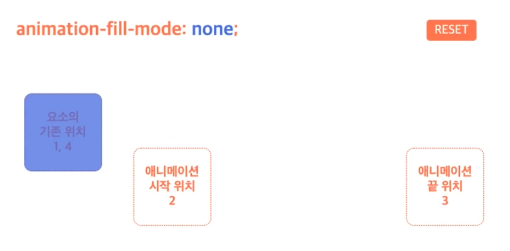
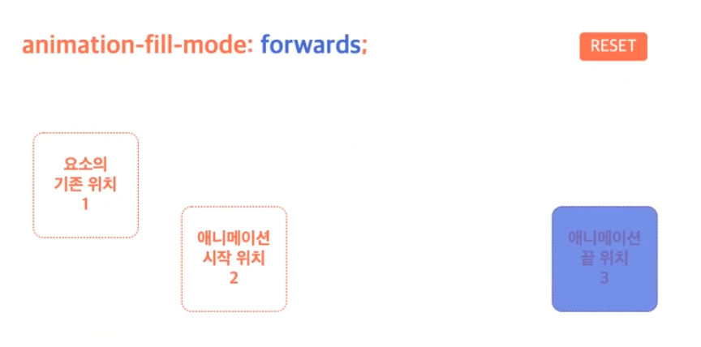
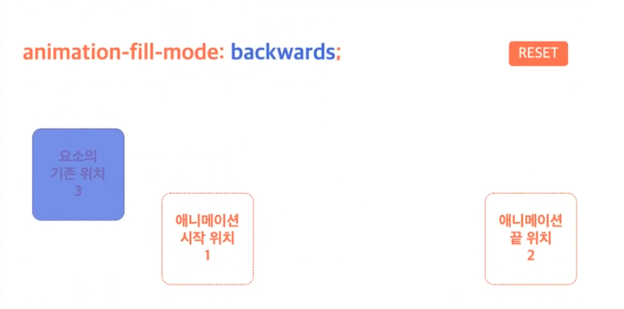
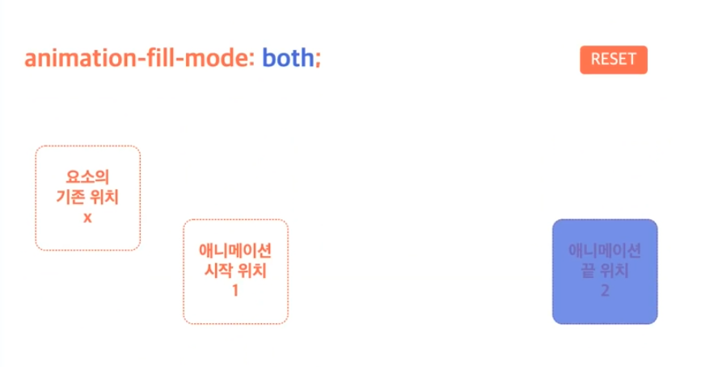
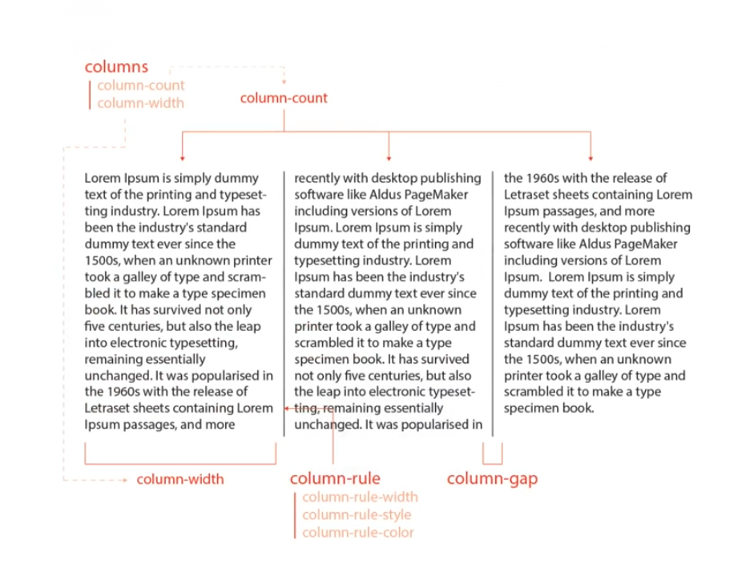

<h3><code>animation</code></h3>
<p>요소에 애니메이션을 설정/제어<code>단축</code></p>
<table>
    <thead>
        <tr>
            <td>값</td>
            <td>의미</td>
            <td><기본값/td>
        </tr>
    </thead>
    <tbody>
        <tr>
            <td><code>animation-name</code></td>
            <td><code>@keyframes</code>규칙의 이름을 지정</td>
            <td><code>none</code></td>
        </tr>
        <tr>
            <td><code>animation-duration</code></td>
            <td>애니메이션의 지속 시간 설정</td>
            <td><code>0s</code></td>
        </tr>
        <tr>
            <td><code>animation-timing-function</code></td>
            <td>타이밍 함수 지정</td>
            <td><code>ease</code></td>
        </tr>
        <tr>
            <td><code>animation-delay</code></td>
            <td>애니메이션의 대기 시간 설정</td>
            <td><code>0s</code></td>
        </tr>
        <tr>
            <td><code>animation-iteration-count</code></td>
            <td>애니메이션의 반복 횟수 설정</td>
            <td><code>1</code></td>
        </tr>
        <tr>
            <td><code>animation-direction</code></td>
            <td>애니메이션의 반복 방향 설정</td>
            <td><code>normal</code></td>
        </tr>
        <tr>
            <td><code>animation-fill-mode</code></td>
            <td>애니메이션의 전후 상태(위치) 설정</td>
            <td><code>none</code></td>
        </tr>
        <tr>
            <td><code>animation-play-state</code></td>
            <td>애니메이션의 재생과 정지 설정</td>
            <td><code>running</code></td>
        </tr>
    </tbody>
</table>

```
animation: 애니메이션이름 지속시간 [타이밍함수 대기시간 반복횟수 반복방향 전후상태 재생/정지];
```
```css
.boxx { 
    width: 100px;
    height: 100px;
    background: red;
    animation: hello 2x linear infinite both;
}

@keframes helle {
    0% { width: 200px; }
    100% { width: 50xp; }
}
```

```css
.box {
    width: 100px;
    height: 100px;
    background: tomato;
}
.box:hover {
    animaton: first-animation 2s infinite alternate;

}
@keyframes first-animation {
    0% {
        width: 100px;
    }
    100% {
        width: 500px;
    }
}
```

<h3><code>@keyframes</code></h3>
<p>2개 이상의 애니메이션 중간 상태(프레임)을 지정</p>

```
@keyframes 애니메이션이름 {
    0% { 속성: 값; }
    50% { 속성: 값; }
    100% { 속성: 값;}
}
```
```css
@keyframes move-box {
    0% { left: 100px; }
    100% { top: 200px; }
}
```

```css
.box {
    width: 100px;
    height: 100px;
    background: red;
    border-radius: 10px;
}
.box:hover {
    animation: my-animation 3s infinite alternate;
}

@keyframes my-animation {
    0% {
        width: 100px;
        background: red
    }
    75% {
        width: 500px;
        background: yellowgreen;
    }
    100% {
        width: 300px;
        background: tomato;
    }
}
```

<h3><code>animation-name</code></h3>
<p><code>@keframes</code>규칙(애니메이션 프레임)의 이름을 지정<code>개별</code></p>
<table>
    <thead>
        <tr>
            <td>값</td>
            <td>의미</td>
            <td>기본값</td>
        </tr>
    </thead>
    <tbody>
        <tr>
            <td><code>none</code></td>
            <td>애니메이션을 지정하지 않음</td>
            <td><code>none</code></td>
        </tr>
        <tr>
            <td><code>@keyframes</code>이름</td>
            <td>이름이 일치하는 <code>@keyframes</code>규칙의 애니메이션을 적용</td>
            <td></td>
        </tr>
    </tbody>
</table> 

<h3><code>animation-duration</code></h3>
<p>애니메이션의 지속 시간 설정<code>개별</code></p>
<table>
    <thead>
        <tr>
            <td>값</td>
            <td>의미</td>
            <td>기본값</td>
        </tr>
    </thead>
    <tbody>
        <tr>
            <td>시간</td>
            <td>지속 시간을 설정</td>
            <td><code>0s</code></td>
        </tr>
    </tbody>
</table>

```css
.box {
    width: 100px;
    height: 100px;
    background: red;
    border-radius: 10px;
}
.box:hover {
    animation-name: my-animation;
    animation-duration: 3s;
}

@keyframes my-animation {
    0% {
        width: 100px;
        background: red
    }
    75% {
        width: 500px;
        background: yellowgreen;
    }
    100% {
        width: 300px;
        background: tomato;
    }
}
```

<h3><code>animation-timing-function</code></h3>
<p>타이밍 함수(애니메이션 효과를 계산하는 방법) 지정<code>개별</code></p>
<table>
    <thead>
        <tr>
            <td>값</td>
            <td>의미</td>
            <td>기본값</td>
            <td>Cubic Bezier 값</td>
        </tr>
    </thead>
    <tbody>
        <tr>
            <td><code>ease</code></td>
            <td>빠르게-느리게</td>
            <td><code>ease</code></td>
            <td><code>cubic-bezier(.25, .1, .25, 1)</code></td>
        </tr>
        <tr>
            <td><code>linear</code></td>
            <td>일정하게</td>
            <td></td>
            <td><code>cubic-bezier(0, 0, 1, 1)</code></td>
        </tr>
        <tr>
            <td><code>ease-in</code></td>
            <td>느리게-빠르게</td>
            <td></td>
            <td><code>cubic-bezier(.42, 0, 1, 1)</code></td>
        </tr>
        <tr>
            <td><code>ease-out</code></td>
            <td>빠르게-느리게</td>
            <td></td>
            <td><code>cubic-bezier(0, 0, .58, 1)</code></td>
        </tr>
        <tr>
            <td><code>ease-in-out</code></td>
            <td>느리게-빠르게-느리게</td>
            <td></td>
            <td><code>cubic-bezier(.42, 0, .58, 1)</code></td>
        </tr>
        <tr>
            <td><code>cubic-bezier(n,n,n,n)</code></td>
            <td>자신만의 값을 정의(<code>0</code>~<code>1</code>)</td>
            <td></td>
            <td></td>
        </tr>
        <tr>
            <td><code>steps(n)</code></td>
            <td><code>n</code>번 분할된 애니메이션</td>
            <td></td>
            <td></td>
        </tr>
    </tbody>
</table>

<h3><code>animation-delay</code></h3>
<p>애니메이션의 대기 시간 설정 <code>개별</code></p>
<table>
    <tr>
        <td>값</td>
        <td>의미</td>
        <td>기본값</td>
    </tr>
    <tr>
        <td>시간</td>
        <td>대기 시간을 설정</td>
        <td><code>0s</code></td>
    </tr>
</table>
<p>음수가 허용됩니다. 음수가 음수가 있을 경우 애니메이션은 바로 시작되지만, 그 값만큼 애니메이션이<br>
앞서 시작합니다.(애니메이션 주기 도중에 시작).</p>

```html
<div class="box box1">0s</div>
<div class="box box2">1s</div>
<div class="box box3">-1s</div>
```
```css
.box {
    width: 150px;
    height: 100px;
    border-radius" 10px;
    margin: 10px;
    color: white;
    font-size: 24px;
    display: flex;
    justify-content: center;
    align-items: center;
}
.box1 { background: tomato; }
.box2 { background: dodgerblue; }
.box3 { background: yellowgreen; }

.box1:hover {
    animation: size-up 1s 2 alternate linear 0s;
}
.box2:hover {
    animation: size-up 1s 2 alternate linear 1s;
}
.box3:hover {
    animation: size-up 1s 2 alternate linear -1s;
}

@keyframes size-up {
    0% {
        width: 150px;
    }
    100% {
        width: 500px;
    }
}
```

<h3><code>animation-iteration-count</code></h3>
<p>애니메이션의 반복 횟수를 설정<code>개별</code></p>
<table>
    <tr>
        <td>값</td>
        <td>의미</td>
        <td>기본값</td>
    </tr>
    <tr>
        <td>숫자</td>
        <td>반복 회수를 설정</td>
        <td><code>1</code></td>
    </tr>
    <tr>
        <td><code>infinite</code></td>
        <td>무한 반복</td>
        <td></td>
    </tr>
</table>

<h3><code>animation-direction</code></h3>
<p>애니메이션의 반복 방향을 설정<code>개별</code></p>
<table>
    <thead>
        <tr>
            <td>값</td>
            <td>의미</td>
            <td>기본값</td>
        </tr>
    </thead>
    <tbody>
        <tr>
            <td><code>normal</code></td>
            <td>정방향만 반복</td>
            <td><code>normal</code></td>
        </tr>
        <tr>
            <td><code>reverse</code></td>
            <td>역방향만 반복</td>
            <td></td>
        </tr>
        <tr>
            <td><code>alternate</code></td>
            <td>정방향에서 역방향으로 반복(왕복)</td>
            <td></td>
        </tr>
        <tr>
            <td><code>alternate-reverse</code></td>
            <td>역방향에서 정방향으로 반복(왕복)</td>
            <td></td>
        </tr>
    </tbody>
</table>

```css
.box {
    width: 100px;
    height: 100px;
    background: red;
    border-radius: 10px;
    margin: 30px;
    animation: move 2s;
    animation-timing-function: linear;
    animation-iteration-count: 2;
    animation-direction: alternate; /* 뱡향을 1개 더 소비함*/
}

@keyframes move {
    0% {
        transform: translate(0, 0);
    }
    25% {
        transform: translate(100px, 0);
    }
    50% {
        transform: translate(100px, 100px);
    }
    75% {
        transform: translate(0, 100px);
    }
    100% {
        transform: translate(0, 0);
    }
}
```
<br>

```css
.box {
    width: 100px;
    height: 100px;
    background: red;
    border-radius: 10px;
    margin: 30px;
    animation: movemove 2s 2s;
    animation-fill-mode: both; /* 애니메이션의 전후 상태를 설정*/
}

@keyframes movemove {
    0% {
        transform: translate(100px, 100px);
        background: dodgerblue;
    }
    100% {
        transform: translate(300px, 100px);
        background: yellowgreen;
    }
}
```

<h3><code>animation-fill-mode</code></h3>
<p>애니메이션의 전후 상태(위치)를 설정<code>개별</code></p>
<table>
    <thead>
        <tr>
            <td>값</td>
            <td>의미</td>
            <td>기본값</td>
        </tr>
    </thead>
    <tbody>
        <tr>
            <td><code>none</code></td>
            <td>기존 위치에서 시작 -> 애니메이션 시작 위치로 이동 -> 동작 -> 기존 위치에서 끝</td>
            <td><code>none</code></td>
        </tr>
        <tr>
            <td><code>forwards</code></td>
            <td>기존 위치에서 시작 -> 애니메이션 시작 위치로 이동 -> 동작 -> 애니메니션 끝 위치에서 끝</td>
            <td></td>
        </tr>
        <tr>
            <td><code>backwards</code></td>
            <td>애니메이션 시작 위치에서 시작 -> 동작 -> 기존 위치에서 끝</td>
            <td></td>
        </tr>
        <tr>
            <td><code>both</code></td>
            <td>애니메이션 시작 위치에서 시작 -> 동작 -> 애니메이션 끝 위치에서 끝</td>
            <td></td>
        </tr>
    </tbody>
</table>
<h4>none</h4>

<h4>forwards</h4>

<h4>backwards</h4>

<h4>both</h4>


<h3><code>animation-play-state</code></h3>
<p>애니메이션의 재생과 정지를 설정<code>개별</code></p>
<table>
    <tr>
        <td>값</td>
        <td>의미</td>
        <td>기본값</td>
    </tr>
    <tr>
        <td><code>runnning</code></td>
        <td>애니메이션을 동작</td>
        <td><code>running</code></td>
    </tr>
    <tr>
        <td><code>paused</code></td>
        <td>애니메이션 동작을 정지</td>
        <td></td>
    </tr>
</table>

```html
<div class="box"></div>
```
```css
body {
    padding: 20px;
}
.box {
    width: 150px;
    height: 100px;
    background: tomato;
    border-radius: 10px;
    animaition: size-up 3s linear infinite alternate;
    display: flex;
    justify-content: center;
    align-items: center;
}
.box::before {
    content: "running";
    font-size: 20px;
    color: white;
    font-weight: 700;
}
.box:hover {
    animation-play-state: paused;
    background: dodgerblue;
}
.box:hover::before {
    content: "paused";
}

@keyframes size-up {
    0% {
        width: 150px;
    }
    100% {
        width: 100%;
    }
}
```

<h3>Multi-Columns</h3>
<p>일반 블록 레이아웃을 확장하여 여러 텍스트 다단으로 쉽게 정리하며, 가독성 확보</p>



<h3><code>columns</code></h3>
<p>다단을 정의<code>개별</code></p>
<table>
    <thead>
        <tr>
            <td>값</td>
            <td>의미</td>
            <td>기본값</td>
        </tr>
    </thead>
    <tbody>
        <tr>
            <td><code>auto</code></td>
            <td>브라우저가 단의 너비와 개수를 설정</td>
            <td><code>auto</code></td>
        </tr>
        <tr>
            <td><code>column-width</code></td>
            <td>단의 최적 너비를 설정</td>
            <td><code>auto</code></td>
        </tr>
        <tr>
            <td><code>column-count</code></td>
            <td>단의 개수를 설정</td>
            <td><code>auto</code></td>
        </tr>
    </tbody>
</table>

```
columns: 너비 개수;
```
```css
.text {
    columns: 100px 2;
}
```

<h3><code>column-width</code></h3>
<p>단의 최적 너비를 설정 <code>개별</code></p>
<table>
    <thead>
        <tr>
            <td>값</td>
            <td>의미</td>
            <td>기본값</td>
        </tr>
    </thead>
    <tbody>
        <tr>
            <td><code>auto</code></td>
            <td>브라우저가 단의 너비를 설정</td>
            <td><code>auto</code></td>
        </tr>
        <tr>
            <td><code>단위</code></td>
            <td><code>px</code>,<code>em</code>,<code>cm</code></td>
            <td></td>
        </tr>
    </tbody>
</table>

```
column-width: 너비;
```
<p>각 단이 줄어들 수 있는 최적 너비(최소 너비)를 설정하며, <br>
요소의 너비가 가변하여 하나의 단이 최적 너비보다 줄어들 경우 단의 개수가 조정됩니다.</p>

<h3><code>column-count</code></h3>
<p>단의 개수를 설정 <code>개별</code></p>
<table>
    <thead>
        <tr>
            <td>값</td>
            <td>의미</td>
            <td>기본값</td>
        </tr>
    </thead>
    <tbody>
        <tr>
            <td><code>auto</code></td>
            <td>브라우저가 단의 개수를 설정</td>
            <td><code>auto</code></td>
        </tr>
        <tr>
            <td><code>숫자</code></td>
            <td>단의 개수를 설정</td>
            <td></td>
        </tr>
    </tbody>
</table>

```
column-count: 개수;
```

[Lorem Ipsum][https://www.lipsum.com/]

<h3><code>column-gap</code></h3>
<p>단과 단 사이의 간격 설정</p>
<table>
    <tr>
        <td>값</td>
        <td>의미</td>
        <td>기본값</td>
    </tr>
    <tr>
        <td><code>normal</code></td>
        <td>브라우저가 단과 단 사이의 간격을 설정(<code>1em</code>)</td>
        <td><code>normal</code></td>
    </tr>
    <tr>
        <td>단위</td>
        <td><code>px</code>,<code>em</code>,<code>cm</code>등 단위로 지정</td>
        <td></td>
    </tr>
</table>

```
column-gap: 간격;
```

<h3><code>column-rule</code></h3>
<p>단과 단 사이의 (구분)선을 지정 <code>단축</code></p>
<table>
    <tr>
        <td>값</td>
        <td>의미</td>
        <td>기본값</td>
    </tr>
    <tr>
        <td><code>column-width</code></td>
        <td>선의 두께를 지정</td>
        <td><code>medium</code></td>
    </tr>
    <tr>
        <td><code>column-style</code></td>
        <td>선의 종류를 지정</td>
        <td><code>none</code></td>
    </tr>
    <tr>
        <td><code>column-color</code></td>
        <td>선의 색상을 지정</td>
        <td>요소의 글자색과 동일</td>
    </tr>
</table>

```
column-rule: 두께 종류 색상;
```
<p>구분선(<code>column-rule</code>)은 단과 단 사이의 간격 중간에 위치합니다.</p>

```css
    p {
        color: tan
        text-align: justify;
        columns: 150px 3;         
        /* column-width: 200px;
        column-count: 3; */
        column-gap: 20px;
        column-rule: 2px solid red;
    }
```