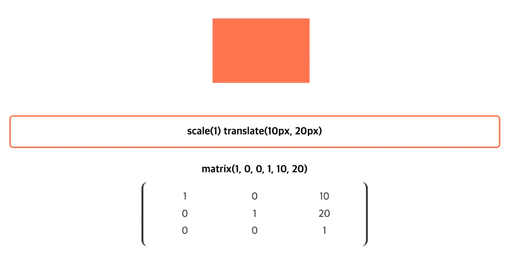

<h3>Transitions</h3>
<p>CSS 속성의 전환 효과를 지정</p>
<br>
<h3><code>transition</code></h3>
<p>CSS 속성의 시작과 끝을 지정(전환 효과)하여 중간 값을 애니메이션 <code>단축</code></p>
<table>
    <thead>
        <tr>
            <td>값</td>
            <td>의미</td>
            <td>기본값</td>
        </tr>
    </thead>
    <tbody>
        <tr>
            <td><code>transition-property</code></td>
            <td>전환 효과를 사용할 속성 이름</td>
            <td><code>all</code></td>
        </tr>
        <tr>
            <td><code>transition-duration</code></td>
            <td>전환 효과의 지속시간 설정</td>
            <td><code>0s</code></td>
        </tr>
        <tr>
            <td><code>transition-timing-function</code></td>
            <td>타이밍 함수 지정</td>
            <td><code>ease</code></td>
        </tr>
        <tr>
            <td><code>transition-delay</code></td>
            <td>전환 효과의 대기시간 설정</td>
            <td><code>0s</code></td>
        </tr>
    </tbody>
</table>
<br>
<h3><code>transition-property</code></h3>
<p>전환 효과를 사용할 속성 이름을 설정<code>개별</code></p>
<table>
    <thead>
        <tr>
            <td>값</td>
            <td>의미</td>
            <td>기본값</td>
        </tr>
    </thead>
    <tbody>
        <tr>
            <td><code>all</code></td>
            <td>모든 속성에 적용</td>
            <td><code>all</code></td>
        </tr>
        <tr>
            <td>속성이름</td>
            <td>전환 효과를 사용할 속성 이름</td>
            <td></td>
        </tr>
    </tbody>
</table>
<h3><code>transition-duration</code></h3>
<p>전환 효과의 지속시간을 설정<code>개별</code></p>
<table>
    <thead>
        <tr>
            <td>값</td>
            <td>의미</td>
            <td>기본값</td>
        </tr>
    </thead>
    <tbody>
        <tr>
            <td>시간</td>
            <td>전환 효과가 지속되는 시간</td>
            <td><code>0s</code></td>
        </tr>
    </tbody>
</table>
<h3><code>transition-timing-function</code></h3>
<p>타이밍 함수(애니메이션 전환 효과를 계산하는 방법) 지정<code>개별</code></p>
<table>
    <thead>
        <tr>
            <td>값</td>
            <td>의미</td>
            <td>기본값</td>
            <td>Cubic Bezier 값</td>
        </tr>
    </thead>
    <tbody>
        <tr>
            <td><code>ease</code></td>
            <td>빠르게-느리게</td>
            <td><code>ease</code></td>
            <td><code>cubic-bezier(.25, .1, .25, 1)</code></td>
        </tr>
        <tr>
            <td><code>linear</code></td>
            <td>일정하게</td>
            <td></td>
            <td><code>cubic-bezier(0, 0, 1, 1)</code></td>
        </tr>
        <tr>
            <td><code>ease-in</code></td>
            <td>느리게-빠르게</td>
            <td></td>
            <td><code>cubic-bezier(.42, 0, 1, 1)</code></td>
        </tr>
        <tr>
            <td><code>ease-out</code></td>
            <td>빠르게-느리게</td>
            <td></td>
            <td><code>cubic-bezier(0, 0, .58, 1)</code></td>
        </tr>
        <tr>
            <td><code>ease-in-out</code></td>
            <td>느리게-빠르게-느리게</td>
            <td></td>
            <td><code>cubic-bezier(.42, 0, .58, 1)</code></td>
        </tr>
        <tr>
            <td><code>cubic-bezier<br>(n,n,n,n)</code></td>
            <td>자신만의 값을 정의<br>(<code>0</code>~<code>1</code>)</td>
            <td></td>
            <td><code></code></td>
        </tr>
        <tr>
            <td><code>steps(n)</code></td>
            <td><code>n</code>번 분할된 애니메이션</td>
            <td></td>
            <td><code></code></td>
        </tr>
    </tbody>
</table>
[Easing Function][https://easings.net/ko]
<br>
<h3><code>transition-delay</code></h3>
<p>전환 효과가 몇 초 뒤에 시작할지 대기시간을 설정<code>개별</code></p>
<table>
    <thead>
        <tr>
            <td>값</td>
            <td>의미</td>
            <td>기본값</td>
        </tr>
    </thead>
    <tbody>
        <tr>
            <td>시간</td>
            <td>전환 효과의 대기시간을 설정</td>
            <td><code>0s</code></td>
        </tr>
    </tbody>
</table>
<br>
<h3><code>transform</code></h3>
<p>요소의 변환 효과(변형)를 지정</p>

```
transform: 변환함수1 변환함수2 변환함수3...;
transform: 원근법 이동 크기 회전 기울임;
```
```CSS
.box {
    transform: rotate(20deg) translate(10px, 0);
}
```
<h3><code>transform</code>2D 변환 함수</h3>
<table>
    <thead>
        <tr>
            <td>값(변환함수)</td>
            <td>의미</td>
            <td>단위</td>
        </tr>
    </thead>
    <tbody>
        <tr>
            <td><code>translate(x, y)</code></td>
            <td>이동(X축, Y축</td>
            <td>단위</td>
        </tr>
        <tr>
            <td><code>translateX(x)</code></td>
            <td>이동(X축)</td>
            <td>단위</td>
        </tr>
        <tr>
            <td>translateY(y)<code></code></td>
            <td>이동(Y축)</td>
            <td>단위</td>
        </tr>
        <tr>
            <td><code>scale(x, y)</code></td>
            <td>크기(X축, Y축)</td>
            <td>없음(배수)</td>
        </tr>
        <tr>
            <td><code>scaleX(x)</code></td>
            <td>크기(X축)</td>
            <td>없음(배수)</td>
        </tr>
        <tr>
            <td><code>scaleY(y)</code></td>
            <td>크기(Y축)</td>
            <td>없음(배수)</td>
        </tr>
        <tr>
            <td><code>rotate(degree)</code></td>
            <td>회전(각도)</td>
            <td><code>deg</code></td>
        </tr>
        <tr>
            <td><code>skew(x-deg, y-deg)</code></td>
            <td>기울임(X축, Y축)</td>
            <td><code>deg</code></td>
        </tr>
        <tr>
            <td><code>skewX(x-deg)</code></td>
            <td>기울임(X축)</td>
            <td><code>deg</code></td>
        </tr>
        <tr>
            <td><code>skewY(y-deg)</code></td>
            <td>기울임(Y축)</td>
            <td><code>deg</code></td>
        </tr>
        <tr>
            <td><code>matrix(n,n,n,n,n,n)</code></td>
            <td>2차원 변환 효과</td>
            <td>없음</td>
        </tr>
    </tbody>
</table>
<h3><code>transform</code>3D 변환 함수</h3>
<table>
    <thead>
        <tr>
            <td>값(변환함수)</td>
            <td>의미</td>
            <td>단위</td>
        </tr>
    </thead>
    <tbody>
        <tr>
            <td><code>translate3d(x, y, z)</code></td>
            <td>이동(X축, Y축, Z축)</td>
            <td>단위</td>
        </tr>
        <tr>
            <td><code>translateZ(z)</code></td>
            <td>이동(Z축)</td>
            <td>단위</td>
        </tr>
        <tr>
            <td><code>scale3d(x, y, z)</code></td>
            <td>크기(X축,Y축,Z축)</td>
            <td>없음(배수)</td>
        </tr>
        <tr>
            <td><code>scaleZ(z)</code></td>
            <td>크기(Z축)</td>
            <td>없음(배수)</td>
        </tr>
        <tr>
            <td><code>rotate3d(x, y, z, a)</code></td>
            <td>회전(X벡터,Y벡터,Z벡터,각도)</td>
            <td>없음,<code>deg</code></td>
        </tr>
        <tr>
            <td><code>rotateX(x)</code></td>
            <td>회전(X축)</td>
            <td><code>deg</code></td>
        </tr>
        <tr>
            <td><code>rotateY(y)</code></td>
            <td>회전(Y축)</td>
            <td><code>deg</code></td>
        </tr>
        <tr>
            <td><code>rotateZ(z)</code></td>
            <td>회전(Z축)</td>
            <td><code>deg</code></td>
        </tr>
        <tr>
            <td><code>perspective(n)</code></td>
            <td>원근법(거리)</td>
            <td>단위</td>
        </tr>
        <tr>
            <td><code>matrix3d(n,n,n,n,n,n,n,n,n,n,n,n,n,n,n,n,n)</code></td>
            <td>3차원 변환 효과</td>
            <td>없음</td>
        </tr>
    </tbody>
</table>

```css
img {
    width: 300px;
    border: 1px solid lightgray;
    transition: 1s;
    transform: perspective(500px) rotateX(45deg);
}
```

<h3><code>transform</code>변환 속성</h3>
<table>
    <thead>
        <tr>
            <td>속성</td>
            <td>의미</td>
        </tr>
    </thead>
    <tbody>
        <tr>
            <td><code>transform-origin</code></td>
            <td>요소 변환의 기준점을 설정</td>
        </tr>
        <tr>
            <td><code>transform-style</code></td>
            <td>3D 변환 요소의 자식 요소도 3D 변환을 사용할지 설정</td>
        </tr>
        <tr>
            <td><code>perspective</code></td>
            <td>하위 요소를 관찰하는 원근 거리를 설정</td>
        </tr>
        <tr>
            <td><code>perspective-origin</code></td>
            <td>원근 거리의 기준점을 설정</td>
        </tr>
        <tr>
            <td><code>backface-visibility</code></td>
            <td>3D 변환으로 회전된 요소의 뒷면 숨김을 설정</td>
        </tr>
    </tbody>
</table>

<h3><code>transform-origin</code></h3>
<p>요소 변환의 기준점을 설정</p>
<table>
    <thead>
        <tr>
            <td>값</td>
            <td>의미</td>
            <td>기본값</td>
        </tr>
    </thead>
    <tbody>
        <tr>
            <td>X축</td>
            <td><code>left</code>,<code>right</code>,<code>center</code>,<code>%</code>, 단위</td>
            <td><code>50%</code></td>
        </tr>
        <tr>
            <td>Y축</td>
            <td><code>top</code>,<code>bottom</code>,<code>center</code>,<code>%</code>, 단위</td>
            <td><code>50%</code></td>
        </tr>
        <tr>
            <td>Z축</td>
            <td>단위</td>
            <td><code>0</code></td>
        </tr>
    </tbody>
</table>

```css
img {
    width: 200px;
    border: 1px solid lightgray;
    transition: 1s;
    transform: rotate(45deg);
    transform-origin: 0% 0%;
 /* transform-origin: right bottom; */
}
```

<h3><code>transform-style</code></h3>
<p>3D 변환 요소의 자식 요소도 3D 변환을 사용할지 설정</p>
<table>
    <thead>
        <tr>
            <td>값</td>
            <td>의미</td>
            <td>기본값</td>
        </tr>
    </thead>
    <tbody>
        <tr>
            <td><code>flat</code></td>
            <td>자식 요소의 3D 변환을 사용하지 않음</td>
            <td><code>flat</code></td>
        </tr>
        <tr>
            <td><code>preserve-3d</code></td>
            <td>자식 요소의 3D 변환을 사용함</td>
            <td></td>
        </tr>
    </tbody>
</table>

```html
<div class="perspective">
    <div class="grand-parent">
        <div class="parent">
            
        </div>
    </div>
</div>
```
```CSS
.perspective {
    width: 200px;
    perspective: 500px;
    padding: 70px;

}
.grand-parent {
    width: 200px;
    border: 3px solid dodgerblue;
    transition: 1s;
    transform: rotateX(-45deg)
    transform-style: preserve-3d; /* 자식요소를 사용할 때 명시해줘야함*/
}
.parent {
    width: 200px;
    border: 3px solid tomato;
    transition: 1s;
    transform: rotateY(45deg);
    transform-style: preserve-3d;
}
img {
    width: 200px;
    border: 3px solid lightgray;
    transition: 1s;
    transform: rotateX(45deg);
}
```

<h3><code>perspective</code></h3>
<p>하위 요소를 관찰하는 원근 거리를 설정</p>
<table>
    <thead>
        <tr>
            <td>값</td>
            <td>의미</td>
            <td>기본값</td>
        </tr>
    </thead>
    <tbody>
        <tr>
            <td>단위</td>
            <td><code>px</code>,<code>em</code>,<code>cm</code>등 단위로 지정</td>
            <td>기본값</td>
        </tr>
    </tbody>
</table>
<h3><code>perspective</code>속성과 함수의 차이점</h3>
<table>
    <thead>
        <tr>
            <td>속성/함수</td>
            <td>적용대상</td>
            <td>기준점 설정</td>
        </tr>
    </thead>
    <tbody>
        <tr>
            <td><code>perspective</code></td>
            <td>관찰(원근법) 대상의 부모 요소</td>
            <td><code>perspective-origin</code></td>
        </tr>
        <tr>
            <td><code>transform: perspective()</code></td>
            <td>관찰(원근법) 대상</td>
            <td><code>transform-origin</code></td>
        </tr>
    </tbody>
</table>
<p>
    <code>perspective</code> 속성은 관찰 대상(여러 개)의 부모(조상) 요소에 적용하여 하위 요소들을 관찰하는 <br>
    원근 거리를 설정하며, <code>transform: persective()</code> 변환 함수는 관찰 대상(1개)에 직접 적용하여
    그 대상을 관찰하는 원근 거리를 설정합니다.
</p>
<br>
<h3><code>perspevtive-origin</code></h3>
<p>원근 거리의 기준점을 설정</p>
<table>
    <thead>
        <tr>
            <td>값</td>
            <td>의미</td>
            <td>기본값</td>
        </tr>
    </thead>
    <tbody>
        <tr>
            <td>X축</td>
            <td><code>left</code>,<code>right</code>,<code>center</code>,<code>%</code>, 단위</td>
            <td><code>50%</code></td>
        </tr>
        <tr>
            <td>Y축</td>
            <td><code>top</code>,<code>bottom</code>,<code>center</code>,<code>%</code>, 단위</td>
            <td><code>50%</code></td>
        </tr>
    </tbody>
</table>

```CSS
.perspective {
    width: 200px;
    perspective: 600px;
    perspective-origin: 50% 50%;
    padding: 70px;

}
.grand-parent {
    width: 200px;
    border: 3px solid dodgerblue;
    transition: 1s;
    transform: rotateX(-45deg)
    transform-style: preserve-3d; /* 자식요소를 사용할 때 명시해줘야함*/
}
.parent {
    width: 200px;
    border: 3px solid tomato;
    transition: 1s;
    transform: rotateY(45deg);
    transform-style: preserve-3d;
}
img {
    width: 200px;
    border: 3px solid lightgray;
    transition: 1s;
    transform: rotateX(45deg);
}
```

<h3><code>backface-visible</code></h3>
<p>3D 변환으로 회전된 요소의 뒷면 숨김을 설정</p>
<table>
    <thead>
        <tr>
            <td>값</td>
            <td>의미</td>
            <td>기본값</td>
        </tr>
    </thead>
    <tbody>
        <tr>
            <td><code>visible</code></td>
            <td>뒷면 숨기지 않음</td>
            <td><code>visible</code></td>
        </tr>
        <tr>
            <td><code>hidden</code></td>
            <td>뒷면 숨김</td>
            <td><code></code></td>
        </tr>
    </tbody>
</table>

```CSS
img {
    width: 300px;
    border: 1px solid lightgray;
    transition: 1s;
    transform: perspective(400px) rotateY(45deg);
    backface-visibility: hidden;
}
```

<h3><code>matrix(a,b,c,d,e,f)</code></h3>
<p>요소의 2차원 변환(Transforms)효과를 지정<br>
<code>scale()</code>,<code>skew()</code>,<code>translate()</code>그리고<code>rotate()</code>를 지정
</p>
<p>
    요소에 일반 변환(Transforms)함수(2D,3D)를 사용하더라도 브라우저에 의해 <code>matrix</code><br>
    함수로 계산되어 적용됩니다.(2D 변환 함수는 <code>matrix</code>로, 3D 변환 함수는 <code>matrix3d</code>로) <br>
    따라서 일반적인 경우는 <code>matrix</code> 함수가 아닌 일반 변환 함수를 사용하면 됩니다.
</p>




