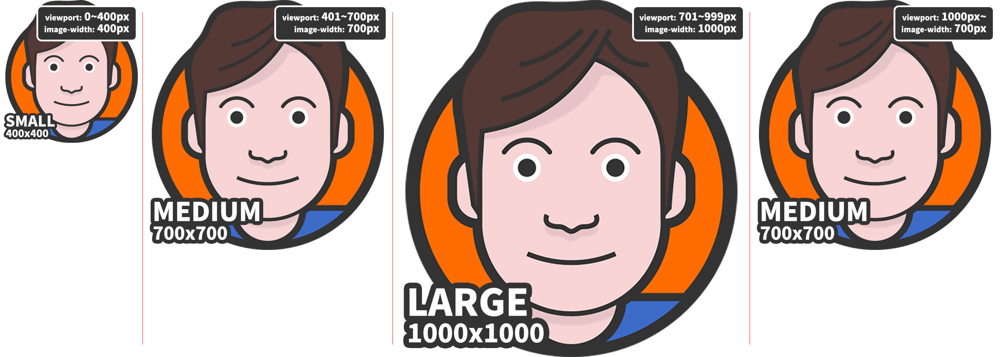
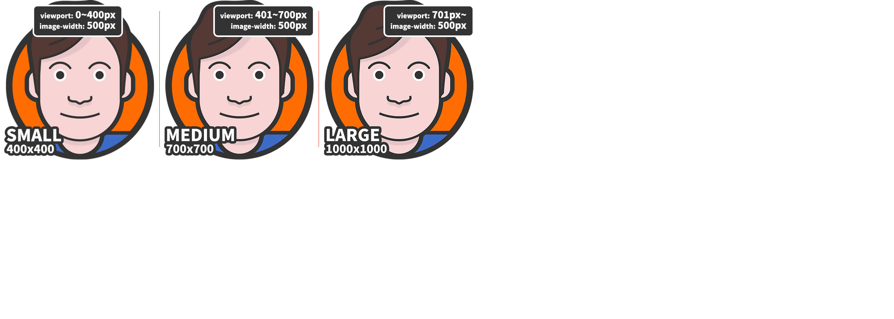
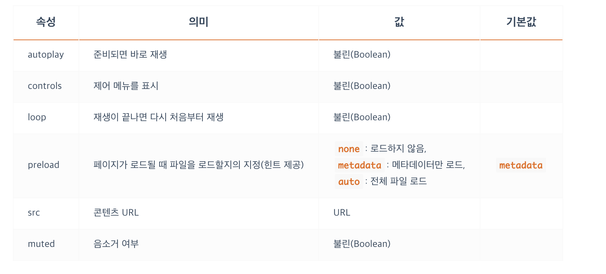

```

이미지를 삽입.
```
</img>

```
img { display: inline; }

Ex)

<!-- srcset, sizes -->
<!-- 다양한 디스플레이 해상도에 맞는 최적의 이미지를 브라우저가 선택해서 사용 -->


srcset 속성은 쉼표(,)로 구분된 사용할 이미지들의 경로와 해당 이미지의 원본 크기를 지정하고,
sizes 속성은 쉼표(,)로 구분된 미디어조건(선택적)과 그에 따라 최적화되어 출력될 이미지 크기를 지정합니다.
```

[HTML IMG의 srcset과 sizes 속성-출처](https://heropy.blog/2019/06/16/html-img-srcset-and-sizes")
```
일반적으로 반응형 웹에서 이미지를 지원하기 위해, ‘미디어쿼리’라고 부르는 CSS Media Rule(@media)에서 background-image 속성을 많이 사용하는데, 
반응형 이미지를 처리하기 위해 뷰포트(Viewport)의 크기부터 사용자 화면의 해상도 등 많은 환경을 고려해야 한다.
하지만 우리는 HTML IMG의 srcset과 sizes를 통해 쉽게는 이미지의 크기를 설정하는 것만으로 대부분의 고려 사항을 사용자 브라우저(User agent)에 떠넘길 수 있다.
```

```
srcset
srcset은 브라우저에 제시할(사용할) 이미지들과 그 이미지들의 원본 크기를 지정합니다.

사용 방법은 간단합니다.

사용할 이미지를 사이즈별로 2장 이상 준비하여 srcset 속성에 작성합니다.
단, 주의사항은 이미지의 크기로 px단위가 아닌 w 디스크립터 혹은 x 디스크립터를 입력해야 하며, 작은 크기 이미지부터 순서대로 입력합니다.
```
```
w 디스크립터(Width descriptor)는 이미지의 원본 크기(가로 너비)를 의미합니다.
예를 들어 400x300(px) 크기 이미지의 w 값은 400w입니다.

브라우저(User agent)는 지정된 w 디스크립터를 통해 각 이미지의 최적화된 픽셀 밀도를 계산합니다.
```
```

HTML


아래와 같이 단지 3장의 이미지와 그 크기만 srcset에 입력했을 뿐인데 브라우저는 각 이미지 중 현재 뷰포트 너비에 최적화된 이미지를 선택해 출력합니다.
마치 다음의 CSS 미디어조건과 비슷합니다.

CSS
.some-image {
  width: 400px;
  height: 400px;
  background-image: url("images/heropy_small.png");   
  background-repeat: no-repeat;
}
@media (min-width: 401px) {
  .some-image {
    width: 700px;
    height: 700px;
    background-image: url("images/heropy_medium.png");   
  }
}
@media (min-width: 701px) {
  .some-image {
    width: 1000px;
    height: 1000px;
    background-image: url("images/heropy_large.png");   
  }
}
```
</img>

```
고정된 이미지 크기를 유지하려면 width 속성을 추가할 수 있습니다.
(sizes 속성과는 다른 개념입니다!)

HTML


이는 다음과 같다.

CSS
.some-image {
  width: 400px;
  height: 400px;
  background-image: url("images/heropy_small.png");   
  background-repeat: no-repeat;
  background-size: cover;
}
@media (min-width: 401px) {
  .some-image {
    background-image: url("images/heropy_medium.png");   
  }
}
@media (min-width: 701px) {
  .some-image {
    background-image: url("images/heropy_large.png");   
  }
}
```
</img>

```
X descriptor
x 디스크립터(Device pixel ratio descriptor)는 이미지의 비율 의도를 의미합니다.
위 w 디스크립터에서 사용했던 예제를 다음과 같이 수정할 수 있습니다.


x 디스크립터는 디바이스의 픽셀 비율(Device pixel ratio)과 일치하는 값으로 최적화 선택됩니다.
mydevice.io에서 현재 화면의 측정 값을 확인할 수 있습니다.

일반적으로 정수(integer) 값으로 제공하는 것이 좋습니다.

w 디스크립터를 사용하면 x 디스크립터를 사용하지 않아도 됩니다.
많은 경우 w 디스크립터의 사용을 추천합니다.
```

```
sizes
sizes는 미디어조건과 그 조건에 해당하는 이미지의 ‘최적화 출력 크기’를 지정합니다.

min-width = ~이상일 때


뷰포트 너비가 400px 이하일 때 heropy_small.png(400px)가 사용됩니다.
뷰포트 너비가 401~700px 일 때 heropy_medium.png(700px)가 사용됩니다.
뷰포트 너비가 701~999px 일 때 heropy_large.png(1000px)가 사용됩니다.
뷰포트 너비가 1000px 이상일 때 heropy_medium.png(700px)가 사용됩니다.

sizes="(min-width: 1000px) 700px"에서 (min-width: 1000px)은 ‘뷰포트 너비(가로)가 1000px 이상일 때’를 의미하며, 
이어나오는 700px은 그 조건일 때 이미지를 ‘700px로 최적화 출력하겠다’를 의미합니다.
그렇다면 700px로 이미지를 출력하기 위해 srcset 목록에서 사용될 최적의 이미지는 heropy_medium.png이며, 
결과로 뷰포트 너비(가로)가 1000px 이상일 때 heropy_medium.png가 사용되었습니다.

```
</img>

```


뷰포트 너비와 상관없이(‘헛 상관이 없다고?!’) heropy_medium.png만 사용됩니다.
또한 heropy_medium.png는 500px의 크기를 가집니다.(원래는 700px 크기의 이미지입니다)
```
</img>

```
sizes는 없고 width가 있을 때


뷰포트 너비가 400px 이하일 때 heropy_small.png가 사용됩니다.
뷰포트 너비가 401~700px 일 때 heropy_medium.png가 사용됩니다.
뷰포트 너비가 701px 이상일 때 heropy_large.png가 사용됩니다.
뷰포트 너비에 따라 사용되는 이미지가 달라지지만 크기는 500px로 고정되었습니다. 
```
</img>

```
width는 이미지의 ‘출력 크기’만 지정하는 데 반해, sizes는 이미지의 ‘출력 크기’ + ‘최적 크기’도 함께 지정하는 개념입니다.
따라서 sizes="500px"이 지정된 첫번째 예제는 500px에 최적화된 이미지로 heropy_medium.png를 사용했고 이미지 크기도 500px로 설정한 것이죠.

sizes와 width를 같이 작성할 경우 width가 우선합니다.

개념이 이해되었다면, 다음과 같이 여러 조건을 작성할 수도 있습니다.
쉼표(,)를 사용해 구분한다는 것을 주의하세요.

<imgㅠsrcset="images/heropy_small.png 400w,
          images/heropy_medium.png 700w,
          images/heropy_large.png 1000w"
  sizes="(min-width: 701px) 1000px,
         (min-width: 401px) 700px,
         400px"
  src="images/heropy.png"
  alt="HEROPY" />


srcset과 sizes는 IE를 지원하지 않습니다.

https://caniuse.com/#feat=srcset
```


```
<audio>
소리 콘텐츠(MP3)를 삽입.

autoplay가 지정된 경우, preload는 무시됨.

audio { display: inline; }

Ex)
<figure>
    <figcaption>Listen to the T-Rex:</figcaption>
    <audio
        controls
        src="/media/cc0-audio/t-rex-roar.mp3">
            Your browser does not support the
            <code>audio</code> element.
    </audio>
</figure>
```
</img>