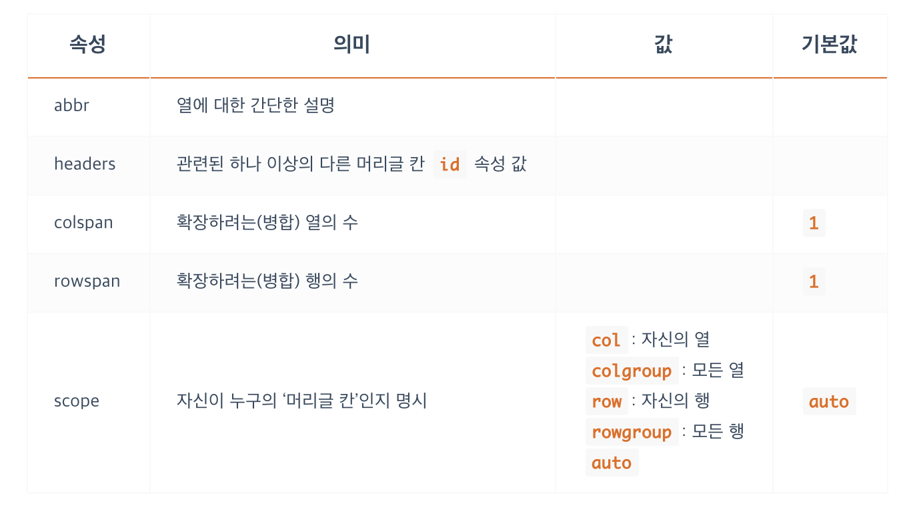

표 콘텐츠

```HTML
<table>
  <caption>Fruits</caption>
  <colgroup>
    <col span="2" style="background-color: yellowgreen;">
    <col style="background-color: tomato;">
  </colgroup>
  <thead>
    <tr>
      <th>ID</th>
      <th>Name</th>
      <th>Price</th>
    </tr>
  </thead>
  <tbody>
    <tr>
      <td>F123A</td>
      <td>Apple</td>
      <td>$22</td>
    </tr>
    <tr>
      <td>F098B</td>
      <td>Banana</td>
      <td>$19</td>
    </tr>
  </tbody>
</table>
```
```
<table>, <tr>, <th>, <td>
데이터 표(<table>)의 행(줄 / <tr>)과 열(칸, 셀(Cell) / <th>, <td>)을 생성.
(Table Row, Table Header, Table Data)

table { display: table; }
tr { display: table-row; }
th, td { display: table-cell; }
```
```
<th>
‘머리글 칸’을 지정
```
</img>

```
<td>
‘일반 칸’을 지정
```
<table>
    <thead>
        <tr>
            <th>속성</th>
            <th>의미</th>
            <th>값</th>
            <th>기본값</th>
        </tr>
    </thead>
    <tbody>
    <tr>
        <td>headers</td>
        <td>
            "관련된 하나 이상의 다른 머리글 칸" <code>id</code> " 속성 값"
        </td>
        <td></td>
        <td></td>
    </tr>
    <tr>
        <td>clospan</td>
        <td>확장하려는(병합) 열의 수</td>
        <td></td>
        <td>
            <code>1</code>
        </td>
    </tr>
    <tr>
        <td>rowspan</td>
        <td>확장하려는(병합) 열의 수</td>
        <td></td>
        <td>
            <code>1</code>
        </td>
    </tr>
    </tbody>
</table>

